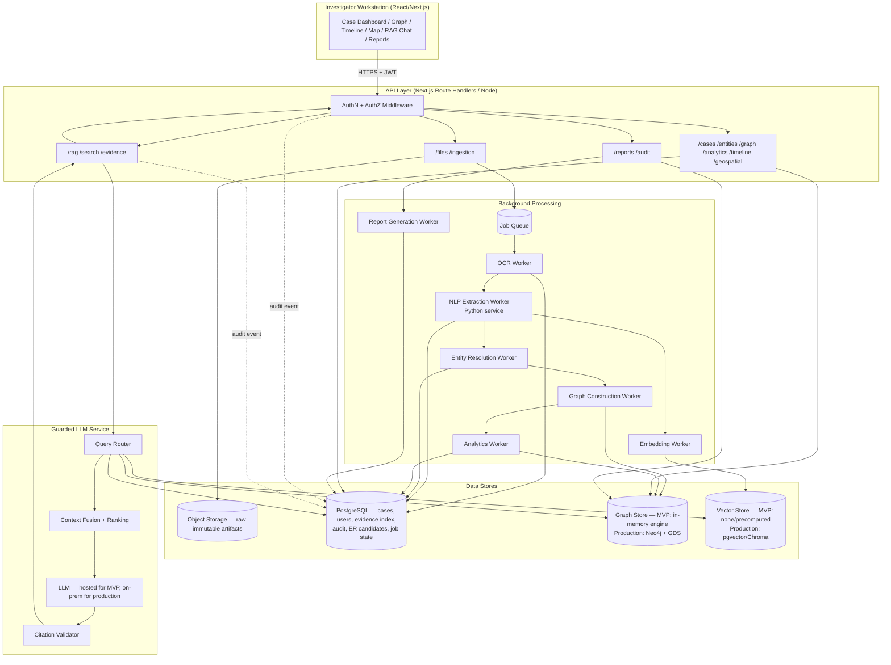

# SIH26189 — AI-Powered Criminal Network Analysis System
## Architecture Design Document

**Status:** Draft for team review — establishes MVP and production architecture
**Author role:** Architecture review (Principal Architect / AI-ML / Security / Data)
**Sources:**
1. `SIH26189-criminal-network-gap-analysis.pdf` ("the gap-analysis doc") — the authoritative document: contains 10 sourced competitive gaps (quotes from Innefu Labs, pi-labs, CAG audit reports), the RAG feature deep-dive (§5), the curated 11-item non-negotiable demo feature list (§7), and the gap map / competitive table (§15).
2. [`lib/research/sih26189-criminal-network-research.md`](../lib/research/sih26189-criminal-network-research.md) — an earlier condensed version of the same research; used only where it doesn't conflict with the gap-analysis doc.

Where the two disagree in emphasis (e.g. exact hackathon MVP scope), the gap-analysis doc's more detailed §5–§7 govern. No separate "RAG design notes" document beyond gap-analysis-doc §5 exists; anything not directly stated there is marked **[RECOMMENDATION]**.

**Working method from this point on:** every feature-level decision in this document is run through five lenses — **Solution** (what to build), **Performance measures** (how we'll know it's good enough, with numbers), **Winning-product angle** (what specifically beats the named competitors — Palantir/i2/CCTNS/spreadsheets — per the gap-analysis doc), **Parameters** (the concrete knobs/scale assumptions), and **Alternatives** (other ways to solve the same problem, so the team can pick). See the new §12.5 **Feature Decision Matrix** for this applied to the 11 non-negotiable demo features, and the same five-lens treatment continues into every future addition to this document.
**Repo reality check performed before writing this doc:** the `preksha` repo currently contains a Next.js 16 / React 19 / TypeScript app with **no backend framework, no database, no Neo4j, and no AI/ML code**. What exists is a synthetic dataset (`lib/data/raw/*.json`) matching FIR/CDR/financial/tower-dump/subscriber shapes, typed in [`lib/data/types.ts`](../lib/data/types.ts), and a working **in-memory graph engine** ([`lib/graph/engine.ts`](../lib/graph/engine.ts)) that already computes degree/weighted-degree, Brandes betweenness, weighted PageRank, label-propagation communities, and network-disruption simulation, entirely client-computable, zero infrastructure. This is a materially different starting point than the source document's Python/FastAPI/Neo4j stack, and is treated as a first-class input to every decision below, not an inconvenience to paper over.

---

## Table of Contents

1. Requirements Extraction
2. Contradictions & Weak Assumptions
3. Architecture Principles
4. High-Level Architecture
5. Data Architecture
6. Neo4j Schema (Production)
7. PostgreSQL Schema
8. RAG Architecture
9. Security Architecture
10. Failure Handling
11. API Architecture
12. MVP Architecture
12.5. Feature Decision Matrix (Solution / Performance / Winning-Product / Parameters / Alternatives)
13. Production Architecture
14. Technology Decisions
15. Complexity & Scalability
16. Observability
17. Implementation Plan
18. Repository Structure
19. Architecture Decision Records
20. Final Architecture

---

# PHASE 1 — Requirements Extraction

Legend: **[SOURCE]** = stated in the source document. **[INFERRED]** = logically implied by stated requirements. **[REC]** = architectural recommendation not present in the source, added because the source is silent or wrong on the point.

## 0. Evidence-based competitive gaps (gap-analysis doc §3) — the "why we win" ledger

The gap-analysis doc doesn't just list features, it cites sourced evidence for each gap. This is the strongest "winning product" material in either source document and should anchor the pitch. Each gap is mapped here to the architecture decision that addresses it, so the claim is backed by a real design choice, not just marketing copy.

| # | Gap (sourced) | Evidence quoted in source | Architecture answer |
|---|---|---|---|
| 1 | Indian FIR NLP extraction — "nobody" has it, only research papers exist (ICDAR 2023, InLegalBERT) | — | Phase 12.5 §1 (FIR NLP) |
| 2 | CDR analysis still done in spreadsheets, which "collapse" past ~3 targets/90 days | pi-labs (2026) | Phase 12.5 §2, Phase 15 sizing (N1a) |
| 3 | No cross-data fusion (FIR+CDR+Financial) — "the picture is always assembled in the past tense" under sequential tools | Innefu Labs (2026) | Phase 5.2 (evidence ladder spans all sources into one graph); Phase 12.1 parallel-ingestion correction below |
| 4 | CCTNS is operationally broken: 63% of operators report technical issues, officers share login credentials, 2,080 unauthorized chargesheets filed in Odisha, no analytics/cross-case module | CAG audit reports (Odisha 2025, Assam) | **This is the strongest argument for taking authorization/audit seriously (Phase 9) rather than as a checkbox** — the credential-sharing and unauthorized-filing findings are exactly the failure modes ADR-08's centralized case-scoped AuthZ and the append-only audit log (Phase 7) are built to prevent. The product's pitch to a CCTNS-literate judge is credibly "we don't repeat CCTNS's access-control failures," not just "we add analytics." |
| 5 | No Hindi/regional-language support; global AI tools underperform on Indian regional languages | Innefu Labs (2026) | Phase 13 production roadmap (explicit future scope, unchanged) |
| 6 | No on-premise/air-gapped option below Palantir's price point | Innefu Labs (2026) | ADR-05, Phase 13 |
| 7 | No court-ready, query-level audit logging — framed as what makes retaining a CDR dataset (sensitive data on many uninvolved people) *defensible*, not just compliant | pi-labs (2026) | Phase 7 `audit_logs` (append-only), Phase 9 — elevated to MVP-critical, see Principle 13/Phase 3 item 2 |
| 8 | No entity resolution across datasets ("Rajesh Kumar" / "9876543210" / "RK Enterprises" / "R. Kumar") | — | Phase 5.3, ADR-06 |
| 9 | No automatic cross-case correlation (phone number appearing in FIR #23 Delhi + FIR #67 Gurgaon + FIR #89 Noida) | Innefu Labs (2026) | Phase 6.5 Cypher example, Phase 9.1 cross-case AuthZ path, Phase 12.5 §8 |
| 10 | Every existing tool processes data **sequentially** (CDR → forensics → financial → OSINT); real investigations develop all threads in parallel, so sequential tools always assemble the picture "in the past tense" | Innefu Labs (2026) | **Correction to this doc's own Phase 12.1/17**, see immediately below |

### Correction: parallel/incremental ingestion belongs in MVP, not just production

Earlier drafts of this document (Phase 4/12/17) designed ingestion as async-but-effectively-sequential per file. Gap #10 is explicit and well-evidenced that *sequential* processing is the specific, named weakness of every existing tool ("the financial angle in week two changes the interpretation of the CDR data from week one"). This does **not** mean real-time streaming (still correctly deferred to production, Phase 13) — it means: when FIR, CDR, and financial files are uploaded for the same case, their ingestion jobs run **concurrently** (not queued behind each other), and each completed stage triggers an **incremental** graph/evidence update and re-cross-reference, rather than waiting for a single "build the whole graph once" batch step at the end. This is cheap to build (the existing Postgres-backed job table, Phase 12.2/ADR-04, already supports multiple concurrent workers pulling independent jobs) and is one of the most defensible "why we're different" claims in the demo, so it is promoted into the MVP critical path — see updated Phase 12.1 and 17.

## A. Functional Requirements

| # | Requirement | Origin |
|---|---|---|
| F1 | Ingest FIRs (PDF/image/text), extract entities (persons, locations, vehicles, phones, IPC sections, dates) | SOURCE |
| F2 | Ingest CDR (CSV/Excel): caller, callee, timestamp, duration, cell, IMEI | SOURCE |
| F3 | Ingest IPDR: session start/end, IP, subscriber, traffic metadata | SOURCE |
| F4 | Ingest financial records: sender, receiver, amount, timestamp, txn ID | SOURCE |
| F5 | Ingest tower dumps: device × tower × time | SOURCE |
| F6 | Ingest CCTV metadata: camera, timestamp, plate | SOURCE |
| F7 | Entity resolution: merge duplicate real-world entities across sources | SOURCE (named), INFERRED (depth — source treats as "fuzzy matching," this doc corrects that, see Phase 2) |
| F8 | Build a POLE-style graph from all ingested data | SOURCE |
| F9 | Interactive network visualization (force-directed, filter, zoom/pan) | SOURCE |
| F10 | Community detection (criminal clusters) | SOURCE |
| F11 | Centrality analysis (betweenness, PageRank, eigenvector, degree) | SOURCE |
| F12 | Key-player / network-disruption analysis | SOURCE |
| F13 | Temporal analysis: bursts, silence, coordination windows | SOURCE |
| F14 | Geospatial mapping of towers/locations/movement | SOURCE |
| F15 | Pattern detection: IMEI sharing, co-location | SOURCE |
| F16 | Multi-case / cross-case correlation | SOURCE |
| F17 | Natural-language query over the investigation (RAG) | SOURCE |
| F18 | Citation-backed answers with source provenance | SOURCE + REC (source implies it via "evidence chain," this doc makes it a hard requirement, see Phase 8/Principles) |
| F19 | Report generation (PDF/JSON export) | SOURCE |
| F20 | Case management (link entities/evidence to cases) | SOURCE |
| F21 | Role-based access control | SOURCE |
| F22 | Audit logging | SOURCE |
| F23 | Full-text / entity search | SOURCE |
| F24 | Timeline reconstruction | SOURCE |
| F25 | Link prediction (suggest likely hidden connections) | SOURCE — **downgraded to future scope, see Phase 2 (probabilistic output risk)** |
| F26 | Network disruption simulation ("if we remove X…") | SOURCE — **already partially implemented** in `simulateDisruption()` |
| F27 | CCTNS / SAHYOG integration | SOURCE, explicitly future scope in source |
| F28 | Hindi/regional language UI and NLP | SOURCE, explicitly future scope in source |
| F29 | Offline / air-gapped field mode | SOURCE, explicitly future scope in source |
| F30 | Every derived fact must be traceable to source evidence with model/parser version | REC (elevated from implicit to explicit, non-negotiable) |
| F31 | Deterministic questions must be answered by deterministic systems, never by LLM free-generation | REC (core principle, see Phase 3) |
| F32 | Authorization decisions must be evaluated before any retrieval reaches the LLM | REC |

## B. Non-Functional Requirements

| # | Requirement | Origin |
|---|---|---|
| N1 | Support "thousands to millions" of CDR records per case | INFERRED from CDR scale claims ("10,000 call records" demo, "2 years of CDR" real-world) |
| N1a | **Concrete sizing parameter — "routine case":** the gap-analysis doc (Gap #2) gives an explicit benchmark: *"Three targets, 90 days = spreadsheet collapses. This is a ROUTINE case shape in India."* At realistic Indian mobile usage (roughly 20–150 calls+SMS/day/number), 3 targets × 90 days ≈ **5,000–40,000 CDR rows** for a routine multi-target case, and a serious NCR-style cross-jurisdiction case (per Gap #9's "FIR #23 Delhi + FIR #67 Gurgaon + FIR #89 Noida" example) can span **tens of thousands of rows across multiple FIRs**. This number — not the demo's 10,000-row CSV — is the actual MVP/production performance target and is used throughout Phase 15. | SOURCE (quoted), sizing derived — REC |
| N2 | Multiple concurrent investigators per deployment | REC (source doesn't quantify; any multi-user RBAC system implies it) |
| N3 | Interactive graph rendering must stay usable at hundreds–low-thousands of nodes; must degrade gracefully beyond that (not silently freeze) | REC |
| N4 | Long-running imports/analytics must not block the request thread | REC |
| N5 | System must be deployable fully offline / air-gapped in production | SOURCE |
| N6 | System must run as a live demo without external network dependency | REC — required for hackathon judging reliability |
| N7 | Idempotent, retryable ingestion | REC |
| N8 | Multi-tenancy / multi-case isolation at the data layer, not just UI filtering | REC |

## C. Security Requirements

| # | Requirement | Origin |
|---|---|---|
| S1 | Authentication (stated as JWT) | SOURCE |
| S2 | Role-based access control | SOURCE |
| S3 | Case-level authorization (not just role-level) | REC — source says RBAC only; this is insufficient, see Phase 2 |
| S4 | Encryption at rest and in transit | REC (implied by "sensitive investigative data," not detailed in source) |
| S5 | Audit logging of access and queries | SOURCE |
| S6 | Immutable raw-evidence storage | REC (source mentions "evidence chain," this doc makes it a hard architectural constraint) |
| S7 | File upload validation and malware handling | REC |
| S8 | OCR/parser sandboxing/isolation | REC |
| S9 | Prompt-injection defense for uploaded documents | REC — source doesn't anticipate this at all |
| S10 | Prevention of cross-case data leakage through RAG/LLM | REC |
| S11 | Secrets management | REC |
| S12 | Supply-chain / container security for offline deployment | REC |

## D. Data Requirements

Covered fully in Phase 5 (Data Architecture). Summary: 7 raw source types (FIR, CDR, IPDR, financial, tower dump, CCTV metadata, other/OSINT), each must retain **raw immutable artifact + structured extraction + provenance links**, per source document and REC (raw retention is not explicit in source but is required for any evidentiary system).

## E. AI/ML Requirements

| # | Requirement | Origin |
|---|---|---|
| M1 | NER over Indian FIR text (Hindi/English), IPC-aware | SOURCE |
| M2 | OCR for scanned/handwritten FIRs | SOURCE |
| M3 | Relationship extraction from FIR narrative | SOURCE |
| M4 | Anomaly detection (isolation forest/autoencoder) | SOURCE, marked future in this doc — see Phase 2 |
| M5 | Graph ML: node classification (GNN), link prediction (GraphSAGE) | SOURCE, marked future — heavy, unproven ROI for MVP |
| M6 | LLM-based natural-language QA over the investigation | SOURCE |
| M7 | LLM must not originate facts; must operate only over retrieved, cited evidence | REC (core, non-negotiable) |
| M8 | On-premise/open-weight LLM for air-gapped production | SOURCE |

## F. Hackathon (MVP) Requirements — as stated by source

Source explicitly lists a 48-hour buildable slice (Section 8 of research doc): FIR upload + NER (pretrained), CDR CSV import, Neo4j graph, vis-network visualization, community detection + centrality via Neo4j GDS, search/filter, timeline, PDF export. Source explicitly defers: real-time streaming, encrypted-messaging inference, financial flow tracing, CCTNS/SAHYOG, Hindi UI, offline mode, disruption simulation.

**Correction to source:** disruption simulation is *already implemented* in the current codebase (`simulateDisruption()`) and costs nothing extra to demo — it should move from "future" back into MVP scope. Conversely, "Neo4j + GDS" as the literal MVP substrate is challenged in Phase 2/14 — the working in-memory engine already satisfies the demo requirement with zero infra risk.

## G. Future/Production Requirements

CCTNS/SAHYOG integration, real-time ingestion, full hybrid RAG with vector store, multilingual NLP, on-prem LLM, richer entity resolution with human review queues, inter-agency workflows, horizontal scaling, formal evidentiary chain-of-custody tooling. Detailed in Phase 13.

---

# PHASE 2 — Contradictions & Weak Assumptions

This section exists to be uncomfortable. Each item below is a real risk in the source material or an easy failure mode for the team to fall into.

### 2.1 Stack mismatch: source says Python/FastAPI/Neo4j, repo says Next.js/TypeScript, zero infra
The source document's tech stack (Section 6) is aspirational and was written before any code existed. The team has since built a working, demo-ready graph engine in TypeScript with **no** Neo4j, **no** Python, **no** database. Continuing to plan around "FastAPI + Neo4j" without acknowledging 592 lines of already-working, tested-by-construction graph code is planning against a fictional codebase. **Resolution:** Phase 14 makes an explicit, justified call — do not discard working code to chase the source document's literal stack; introduce Python only where TypeScript has no viable equivalent (OCR/NLP model ecosystem), and introduce Neo4j only on the production timeline, behind an abstraction the in-memory engine already satisfies for MVP.

### 2.2 "Fuzzy matching" is being asked to do the job of an entire subsystem
The source lists "deduplication (fuzzy matching)" as a one-line step. Entity resolution is where wrongful association happens: merging "Rajesh Kumar" the suspect with "Rajesh Kumar" the witness in a different FIR because names are similar is not a UX bug, it is a false accusation waiting to happen. **Resolution:** Phase entity-resolution design (embedded in Phase 5) treats ER as a scored, human-reviewable, reversible pipeline — never an automatic merge on name similarity alone.

### 2.3 Centrality is being conflated with guilt/leadership
Source text literally says PageRank identifies "the kingpin" (Section 3, "Centrality Analysis"). A high-PageRank node is a *structurally important* node — it can just as easily be a shared lawyer, a common cell tower artifact, a call-center number, or a family member who happens to route a lot of calls. **Resolution:** Principle P-6 (Phase 3) and UI copy requirements (Phase 9/10): centrality outputs are always labeled "structural indicator," never "leader"/"kingpin" in generated text; investigator judgment required before any such label is used in a report.

### 2.4 Letting the LLM answer deterministic questions
If "how much money moved between A and B" goes to the LLM instead of a database aggregation, the number can be hallucinated with full confidence. This is explicitly flagged by the project brief as the central risk, and the source document's RAG description (external notes, not in the repo) does not describe query routing at all. **Resolution:** Phase 8 query router is mandatory, not optional, and is on the MVP critical path (a minimal rule-based version, not ML-based, for MVP).

### 2.5 "Court-admissible under Section 65B" claim in the source demo script
Source Section 7 (Demo Scenario) has the presenter say the exported PDF "is court-admissible under Section 65B." **This is a legal claim the engineering team cannot make.** Section 65B of the Indian Evidence Act sets conditions (a certifying officer's certificate, chain of custody, device identification) that are procedural and legal, not something a PDF export button confers. **Resolution:** this document explicitly forbids any UI/report copy claiming admissibility. Reports may state what they contain and how it was produced (provenance), never a legal admissibility conclusion. Flagged again in Phase 10/20.

### 2.6 Storing everything in Neo4j
The source's Layer 3 diagram puts Person/Phone/Vehicle/Location/Crime/Event nodes with rich properties (age, address, criminal history) directly as graph node properties. Putting mutable, large, or access-controlled attribute data (full addresses, criminal history, document text) directly on graph nodes couples graph traversal performance to unrelated data-access patterns, and makes case-level ACL enforcement inside Cypher fragile. **Resolution:** Phase 6 — Neo4j holds identity, relationship structure, minimal display properties, and pointers (IDs) back to PostgreSQL/object storage, which hold the authoritative attribute and evidence data.

### 2.7 Oversimplified event modeling ("Person -CALLED-> Person")
Modeling a call as a single edge between two Person nodes destroys forensic detail: which of 40 calls is this, what date, what duration, from which of a person's two phones. It also makes it impossible to answer "show me the specific communication events, with evidence" rather than "these two people have called." **Resolution:** Phase 6 — communications, transactions, and observations are **first-class event nodes** (or relationships with rich per-instance properties plus an evidence-record backing table), never collapsed into a single aggregate edge, even though the UI may *render* an aggregated edge for readability.

### 2.8 30-feature MVP scope in a 48-hour build
Source Section 4 lists 30 features as "core" + "advanced" and Section 8 claims most of them are 48-hour buildable, including Neo4j GDS operations, OCR, fine-tuned NLP, PDF generation, plus RAG (RAG isn't even listed in section 8, meaning the source's own MVP scope is already incomplete against the project's stated primary goal of NL querying). **Resolution:** Phase 12 defines a much smaller, sequenced MVP; several "core" features (link prediction, tower-dump analytics, financial-flow tracing, real network-wide OCR) are explicitly deferred with a stated reason.

### 2.9 Introducing microservices/Kafka/Kubernetes without a load that needs them
Nothing in the requirements — hackathon or near-term production (single agency, on-prem, air-gapped, investigator-count in the tens) — justifies a distributed streaming platform or container orchestration. **Resolution:** Phase 14/17 explicitly rejects Kafka/K8s for both MVP and initial production; a background job queue (single-process or Postgres-backed) is sufficient until there's a measured reason otherwise.

### 2.10 Vector search is not graph reasoning
The source's RAG framing (and common failure mode in similar systems) risks treating "vector similarity over documents" as if it can answer relationship/graph questions ("who is connected to X"). It cannot — a paragraph mentioning two names does not mean the graph has a resolved relationship between them. **Resolution:** Phase 8's router hard-separates graph-shaped questions (structure, paths, aggregation) from document-shaped questions (narrative, "what does the FIR say"), and hybrid questions explicitly fuse both retrieval results rather than letting vector search stand in for graph traversal.

### 2.11 Frontend graph rendering has no stated scale limit
Force-directed rendering of "all entities" (source Section 5, Layer 6) with thousands of nodes will freeze a browser tab. Source never specifies a rendering budget. **Resolution:** Phase 15 sets an explicit rendering budget (~500–800 visible nodes before mandatory server-side aggregation/filtering) and requires progressive disclosure (expand-on-click neighborhoods) rather than "render the whole case."

### 2.12 Synchronous ingestion implied by demo script
Source demo script implies upload → immediate graph appears. For a 10,000-row CDR file with OCR/NLP in the loop, synchronous processing inside an HTTP request is a timeout risk and blocks the UI thread. **Resolution:** Phase 4/11 — ingestion is asynchronous with job status polling from the first version of the ingestion pipeline, even in MVP (this is cheap to build correctly and expensive to retrofit).

### 2.13 Audit logging as an afterthought
Source lists "audit logging" as feature #30 of 30, framed as a checkbox. In an evidentiary system, the audit log is as legally important as the data itself (who queried what, when, and what the system returned). **Resolution:** audit logging is elevated to Phase 3 principle and is on the MVP critical path for at least query-level and access-level events (not full production SIEM-grade logging).

### 2.14 RBAC alone is not authorization
"JWT + RBAC" (source Section 6) tells you a user's role, not what cases/entities/evidence they may see. A role check that passes but a case-scope check that's missing is a real data-leak path (Officer from Case A queries and receives Case B's evidence because "Investigator" role alone was checked). **Resolution:** Phase 9 defines authorization as **role × case-assignment × sensitivity-tag**, evaluated as a mandatory pre-retrieval gate, not a post-hoc filter.

### 2.15 Link prediction and anomaly detection presented as findings, not hypotheses
GraphSAGE-predicted links and isolation-forest anomalies are probabilistic outputs. Presenting "Person Y is likely the next target" (source Section 3, "Predictive Analysis") as a system finding rather than a flagged hypothesis is investigatively and ethically dangerous — it can bias an investigation before any human review. **Resolution:** these features are (a) out of MVP scope, (b) when built, are rendered in a visually distinct "hypothesis" UI state that cannot be exported into a report without a human-reviewed confidence annotation.

---

# PHASE 3 — Architecture Principles

1. **Evidence first.** Nothing enters the graph or a report without a traceable evidentiary origin.
2. **Deterministic computation before generation.** Any question with a computable ground truth (counts, sums, paths, centrality, membership) is answered by the graph/relational engine, never the LLM.
3. **Authorization before retrieval.** Case/entity access is checked before any data — graph, vector, or relational — is fetched for a query. The LLM never sees data the requester isn't authorized to see; it cannot be asked to "not mention" it after the fact.
4. **Provenance by default, not by request.** Every extracted entity, resolved identity, and derived relationship carries a pointer back to its source record, extraction method, model/version, and timestamp, generated automatically by the pipeline stage that produced it.
5. **Untrusted documents.** Every uploaded file, and every string extracted from it, is treated as adversarial input until validated — for parsers (malformed file attacks) and for the LLM (prompt injection embedded in narrative text).
6. **The LLM is not the source of truth.** It explains and summarizes retrieved, cited evidence. It does not originate facts, relationships, or numbers. Structural analytics (centrality, community) are indicators, never verdicts — no output may equate a metric with guilt, leadership, or legal status.
7. **Human-reviewable entity resolution.** Any merge above a low-confidence threshold requires human confirmation; every merge is reversible and logged with the evidence that justified it.
8. **Immutable raw evidence.** The original uploaded artifact is never modified or deleted by any downstream process; all extraction/normalization produces *derived* records that reference, but do not replace, the original.
9. **Idempotent, resumable ingestion.** Re-uploading the same file or re-running a failed pipeline stage must not duplicate data or corrupt state.
10. **Case isolation is structural, not incidental.** A query cannot cross case boundaries by omission — cross-case correlation is an explicit, authorized, logged operation, not a side effect of a loosely scoped query.
11. **Modular MVP-to-production evolution.** Every MVP simplification (in-memory graph, mocked NLP, single LLM call) sits behind an interface whose production implementation can be swapped without changing callers.
12. **No infrastructure without a measured need.** Message queues, container orchestration, and microservice boundaries are introduced when a specific, current bottleneck justifies them — not preemptively.
13. **Confidence is a first-class value, not a footnote.** Every entity-resolution decision, extraction, and analytical output carries a confidence/limitation statement that the UI surfaces, not buries.
14. **Async by default for anything that can be slow.** OCR, NLP, embedding, graph construction, analytics, and report generation run as background jobs with observable status; the HTTP request layer only enqueues and reports state.
15. **Citations are structured data, not LLM prose.** A citation is an object with source type/id/record/timestamp/confidence, validated against the retrieval set before being shown — the LLM cannot free-type a citation into existence.
16. **Legal claims require a legal process, not a checkbox.** The system states what it did and how (provenance-complete), and explicitly declines to assert admissibility, legal sufficiency, or evidentiary conclusions.
17. **Fail loud, degrade gracefully.** A failed OCR/NLP/analytics stage marks the record/job as needing attention and does not silently drop data or silently proceed with partial results presented as complete.
18. **Least privilege by default.** New roles, endpoints, and background jobs start with the minimum scope needed and are widened deliberately, not the reverse.

---

# PHASE 4 — High-Level Architecture



**Trust boundaries (numbered on the diagram conceptually):**
1. Client ↔ API — untrusted network, TLS required, JWT validated per request.
2. API ↔ Background workers — internal trust boundary; workers still re-validate case scoping (defense in depth), because a compromised/buggy enqueue must not become an authorization bypass.
3. Uploaded file content ↔ parsers (OCR/NLP) — untrusted-content boundary; parsers run with no access to the graph/relational stores beyond writing their own extraction output, and no outbound network access in production (air-gapped requirement doubles as a security control here).
4. Retrieved evidence ↔ LLM — untrusted-content boundary; the LLM receives evidence text as **data**, never as instructions, and its output is validated (citations must resolve to real retrieved records) before being returned to the user.
5. Case A data ↔ Case B data — authorization boundary enforced at the query layer (Postgres row-level policies / graph query parameterization), not only at the UI.

---

# PHASE 5 — Data Architecture

## 5.1 Object ownership

| Object | Authoritative store | Notes |
|---|---|---|
| Source artifact (raw file: FIR PDF/image, CDR CSV, financial CSV, tower dump CSV, CCTV metadata) | Object storage (filesystem/MinIO, immutable) | Never edited; hash-addressed; referenced by `document_id` |
| Document metadata (filename, uploader, upload time, hash, mime, case) | PostgreSQL `files` | Row per upload |
| Case | PostgreSQL `cases` | Owns access grants |
| Person / Organization / Phone / Device / Vehicle / Location (canonical identity) | Graph store (node identity) + PostgreSQL (attribute detail, PII) | Graph holds ID + minimal display props; Postgres holds full attributes for ACL/PII control |
| FIR (structured record) | PostgreSQL `firs` (or evidence table) + Graph (Crime/FIR node referencing it) | Narrative text lives in Postgres/object storage; graph never stores full narrative |
| Communication event (single CDR row) | PostgreSQL `communication_events` (bulk) + Graph (aggregated edges + sampled/linked event refs) | See 2.7 — never collapse to a single edge only |
| Transaction | PostgreSQL `transactions` (bulk) + Graph (edges/paths) | Same pattern as communications |
| Observation (tower dump row, CCTV sighting) | PostgreSQL `observations` (bulk) + Graph (OBSERVED_AT edges, sparse) | Bulk data stays relational; graph holds only what's needed for traversal |
| Evidence record (extraction provenance: which model, which source span, confidence) | PostgreSQL `evidence` | The backbone of "why does this relationship exist" |
| Analytical result (centrality run, community assignment, disruption simulation) | PostgreSQL `analytical_runs` (metadata + summary) + Graph (per-node metric properties, versioned by run id) | Never overwrite prior run silently — see Phase 6 temporal strategy |
| Inference/hypothesis (link prediction, anomaly score) | PostgreSQL `inferences`, explicitly separate table from `evidence` | Never merged into the evidence/fact tables |
| Entity-resolution candidate/decision | PostgreSQL `entity_resolution_candidates` | Reviewable, reversible |
| Vector embeddings | Vector store (production) / none (MVP) | Embeddings reference `evidence_id`/`document_id`, never store raw PII beyond what's already in the source |
| Audit log | PostgreSQL `audit_logs`, append-only | Who, what, when, case scope, query text, result summary |
| Report | PostgreSQL `reports` (metadata) + object storage (rendered PDF/JSON) | Generation is fully reproducible from cited data |

## 5.2 The seven layers of truth (explicit, enforced by schema — not convention)

1. **Observed evidence** — the raw artifact (`files`, object storage).
2. **Extracted information** — NLP/OCR output before resolution (`evidence` rows tagged `stage=extraction`, unresolved entity mentions).
3. **Resolved entity** — canonical Person/Phone/etc. after entity resolution (`entities` + `entity_resolution_candidates` with accepted decision).
4. **Derived relationship** — graph edges built from resolved entities + linked events (`graph` edges, each referencing the `evidence` rows that support it).
5. **Analytical result** — centrality/community/disruption output (`analytical_runs`, deterministic, versioned, reproducible from #4).
6. **Inference/hypothesis** — link prediction, anomaly detection (`inferences`, probabilistic, never conflated with #4/#5).
7. **Recommendation** — investigator-facing suggestion ("consider reviewing X"), always generated from #5/#6 with explicit confidence, never presented as a fact.

This ladder is the single most important invariant in the system: **nothing may silently move up a rung.** A UI or LLM component that turns a stage-6 inference into stage-4 prose ("A is connected to B") without qualification is a bug, and Phase 8/9 build guardrails specifically against it.

## 5.3 Entity resolution pipeline (correcting Section 2.2)

```
Raw mentions (per source: FIR text mention, CDR phone number, financial account holder name)
   │
   ▼
1. Normalization  — phone → E.164, name casing/whitespace, IMEI/IMSI format checks
   │
   ▼
2. Deterministic linking  — exact phone match, exact IMEI match, exact account number match
   │  (high confidence, auto-applied, still logged)
   ▼
3. Candidate generation  — blocking by phone-prefix/city/case, then fuzzy name similarity
   │  (Jaro-Winkler/embedding similarity), phonetic match for transliteration variants
   ▼
4. Contextual scoring  — co-occurrence in same FIR, shared address, shared device (IMEI),
   │  temporal proximity, existing case linkage → composite confidence score
   ▼
5. Threshold routing
   ├─ score ≥ auto-merge threshold (deterministic identifiers only, e.g. exact phone) → auto-merge, logged
   ├─ mid confidence → queued for human review (side-by-side evidence, accept/reject/merge-partial)
   └─ low confidence → kept as distinct entities, surfaced only as "possible match" in UI, never merged
   │
   ▼
6. Merge decision recorded — reversible: merge stores both original entity IDs + the evidence
     used, so an investigator can un-merge without data loss
```

**Never:** merge on name-string similarity alone. Name similarity is one signal among several and, on its own, never crosses the auto-merge threshold — it can at most produce a mid-confidence candidate.

---

# PHASE 6 — Neo4j Schema (Production)

**Node labels and key properties**

| Label | Key properties | Notes |
|---|---|---|
| `Person` | `id` (UUID, app-generated), `case_ids[]`, `display_name`, `known` (bool), `pg_ref` | Full PII lives in Postgres; graph keeps display + case scoping only |
| `Phone` | `id`, `e164`, `case_ids[]` | |
| `Device` | `id`, `imei`, `imsi`, `case_ids[]` | |
| `Vehicle` | `id`, `registration`, `case_ids[]` | |
| `Location` | `id`, `type` (address/tower/poi), `lat`, `lng`, `case_ids[]` | |
| `Organization` | `id`, `display_name`, `case_ids[]` | |
| `FinancialAccount` | `id`, `bank`, `masked_number`, `case_ids[]` | |
| `Case` | `id`, `title`, `status`, `created_at` | Anchors case-scoping |
| `FIR` | `id`, `fir_no`, `case_id`, `pg_ref` | |
| `CommEvent` | `id`, `timestamp`, `duration_sec`, `call_type`, `pg_ref` | One node per CDR row *only when it participates in a traversal-relevant pattern* (see below); bulk rows stay relational, see 6.3 |
| `Transaction` | `id`, `timestamp`, `amount`, `pg_ref` | |
| `Observation` | `id`, `timestamp`, `source` (tower_dump/cctv), `pg_ref` | |
| `EvidenceRef` | `id`, `document_id`, `record_id`, `stage`, `confidence`, `extractor_version` | Attached to any node/edge needing "why" |

**Relationship types and key properties**

| Type | From → To | Properties |
|---|---|---|
| `CALLED` | Phone → Phone | aggregate only: `call_count`, `total_duration_sec`, `first_ts`, `last_ts` — **plus** `sample_event_ids[]` pointing at `CommEvent`/Postgres rows; the edge is a readable summary, the events are the evidence |
| `PARTICIPATED_IN` | Phone → CommEvent | per-call linkage when full fidelity is needed for a specific investigation thread |
| `OWNS` / `USES` | Person → Phone/Device/Vehicle | `confidence`, `evidence_ref` |
| `LOCATED_AT` | Person/Phone → Location | `first_seen`, `last_seen`, `confidence` |
| `TRANSACTED_WITH` | FinancialAccount → FinancialAccount | aggregate + `sample_transaction_ids[]` |
| `TRANSFERRED_TO` | Transaction → FinancialAccount | |
| `OBSERVED_AT` | Person/Vehicle → Observation | |
| `INVOLVED_IN` | Person → FIR | `role` (complainant/accused/witness), `evidence_ref` |
| `OCCURRED_AT` | FIR → Location | |
| `PART_OF` | any node → Case | case scoping edge, mirrors `case_ids[]` property for query flexibility |
| `KNOWS` | Person → Person | **derived, not primary** — only materialized from a documented rule (e.g., co-accused in same FIR); always carries `derived_from` pointing to the FIR/event that produced it |
| `MENTIONED_IN` | any entity → FIR/Document | supports "why is this entity even in the case" |
| `ASSOCIATED_WITH` | any → any | generic low-confidence link, always carries `confidence` and `evidence_ref`, used sparingly |

## 6.1 Indexes & constraints

```cypher
CREATE CONSTRAINT person_id_unique IF NOT EXISTS FOR (p:Person) REQUIRE p.id IS UNIQUE;
CREATE CONSTRAINT phone_e164_unique IF NOT EXISTS FOR (p:Phone) REQUIRE p.e164 IS UNIQUE;
CREATE CONSTRAINT device_imei_unique IF NOT EXISTS FOR (d:Device) REQUIRE d.imei IS UNIQUE;
CREATE CONSTRAINT case_id_unique IF NOT EXISTS FOR (c:Case) REQUIRE c.id IS UNIQUE;
CREATE INDEX person_case_idx IF NOT EXISTS FOR (p:Person) ON (p.case_ids);
CREATE INDEX commevent_ts_idx IF NOT EXISTS FOR (e:CommEvent) ON (e.timestamp);
CREATE INDEX location_geo_idx IF NOT EXISTS FOR (l:Location) ON (l.lat, l.lng);
```

## 6.2 Temporal strategy

- Event-level nodes/edge properties carry real timestamps (`timestamp`, `first_ts`/`last_ts`) — never mutated after creation.
- Analytical results (centrality, community) are **versioned**: each run writes `metric_<name>_v<run_id>` properties or, cleaner, a separate `AnalyticalRun` node linked via `COMPUTED_FOR {run_id}` so historical runs remain queryable and a report can cite "as computed on 2026-08-01, run #17" rather than an ever-mutating live number.
- No in-place deletion of relationships derived from evidence; a superseded/incorrect derived relationship is marked `superseded_by`/`invalid_reason` rather than deleted, preserving audit trail.

## 6.3 Case isolation strategy

Every node and case-scoped relationship carries `case_ids[]`. All application-issued Cypher is **parameterized with the caller's authorized case set** and filters `WHERE any(c IN n.case_ids WHERE c IN $authorizedCases)` — this is enforced in a single query-building layer (never hand-assembled per endpoint) so it cannot be forgotten on a new route. Cross-case correlation queries are a distinct, explicitly logged operation that requires a specific cross-case permission, not an accidental consequence of an unscoped query.

## 6.4 Why not put full CDR volume as graph nodes

Millions of `CommEvent` nodes for years of CDR history would dominate graph size with data the graph rarely needs to traverse individually. Decision: only materialize `CommEvent`/`Transaction`/`Observation` as graph nodes when (a) they're referenced as `sample_event_ids` for evidence drill-down, or (b) a specific analysis (temporal burst detection) needs per-event graph traversal for a bounded time window. Bulk storage and aggregation stay in PostgreSQL, which is what it's for.

## 6.5 Example Cypher — representative investigator questions

```cypher
// "Which suspects occur in multiple FIRs?" — deterministic, no LLM
MATCH (p:Person)-[:INVOLVED_IN]->(f:FIR)
WHERE any(c IN p.case_ids WHERE c IN $authorizedCases)
WITH p, count(DISTINCT f) AS firCount
WHERE firCount > 1
RETURN p.id, p.display_name, firCount
ORDER BY firCount DESC;

// "Who has highest betweenness centrality in Case X?" — read precomputed run, not live GDS call per request
MATCH (r:AnalyticalRun {case_id: $caseId, metric: 'betweenness'})-[:COMPUTED_FOR]->(p:Person)
RETURN p.display_name, r.value, r.run_id, r.computed_at
ORDER BY r.value DESC LIMIT 10;

// "Shortest path between A and B, with evidence" — graph structure + evidence pointers
MATCH path = shortestPath((a:Person {id: $a})-[*..6]-(b:Person {id: $b}))
WHERE all(n IN nodes(path) WHERE any(c IN n.case_ids WHERE c IN $authorizedCases))
RETURN [n IN nodes(path) | n.display_name] AS chain,
       [r IN relationships(path) | {type: type(r), evidence: r.evidence_ref}] AS evidenceChain;

// "What happened in the 24h before FIR #23's incident time?" — temporal window query
MATCH (f:FIR {fir_no: $firNo})
MATCH (p:Person)-[:INVOLVED_IN]->(f)
MATCH (p)-[:OWNS|USES]->(ph:Phone)-[:PARTICIPATED_IN]->(e:CommEvent)
WHERE e.timestamp >= datetime(f.incident_ts) - duration('P1D') AND e.timestamp <= datetime(f.incident_ts)
RETURN p.display_name, e.timestamp, e.pg_ref
ORDER BY e.timestamp;

// Community membership for a case (reads precomputed run)
MATCH (r:AnalyticalRun {case_id: $caseId, metric: 'community', run_id: $latestRunId})-[:COMPUTED_FOR]->(p:Person)
RETURN r.community_id, collect(p.display_name) AS members
ORDER BY r.community_id;
```

Note the pattern: **centrality/community reads never invoke a live algorithm inside a user-facing request** — they read the latest precomputed `AnalyticalRun`. Algorithms run as background jobs (Phase 4/14/15) and the API only serves results.

---

# PHASE 7 — PostgreSQL Schema

Representative DDL (abbreviated — full migration files belong in `backend/db/migrations`, not this document).

```sql
-- Identity & access
CREATE TABLE users (
  id UUID PRIMARY KEY DEFAULT gen_random_uuid(),
  username TEXT UNIQUE NOT NULL,
  password_hash TEXT NOT NULL,
  display_name TEXT NOT NULL,
  is_active BOOLEAN NOT NULL DEFAULT true,
  created_at TIMESTAMPTZ NOT NULL DEFAULT now()
);

CREATE TABLE roles (
  id SERIAL PRIMARY KEY,
  name TEXT UNIQUE NOT NULL          -- 'investigator', 'supervisor', 'analyst', 'admin', 'auditor'
);

CREATE TABLE user_roles (
  user_id UUID REFERENCES users(id),
  role_id INT REFERENCES roles(id),
  PRIMARY KEY (user_id, role_id)
);

-- Case scoping (the real authorization surface — see Phase 2.14)
CREATE TABLE cases (
  id UUID PRIMARY KEY DEFAULT gen_random_uuid(),
  title TEXT NOT NULL,
  status TEXT NOT NULL DEFAULT 'open',
  sensitivity TEXT NOT NULL DEFAULT 'standard',   -- 'standard' | 'restricted'
  created_by UUID REFERENCES users(id),
  created_at TIMESTAMPTZ NOT NULL DEFAULT now()
);

CREATE TABLE case_assignments (
  case_id UUID REFERENCES cases(id),
  user_id UUID REFERENCES users(id),
  access_level TEXT NOT NULL,        -- 'read' | 'contribute' | 'manage'
  granted_by UUID REFERENCES users(id),
  granted_at TIMESTAMPTZ NOT NULL DEFAULT now(),
  PRIMARY KEY (case_id, user_id)
);

-- Raw artifacts & ingestion
CREATE TABLE files (
  id UUID PRIMARY KEY DEFAULT gen_random_uuid(),
  case_id UUID REFERENCES cases(id) NOT NULL,
  source_type TEXT NOT NULL,          -- 'fir' | 'cdr' | 'ipdr' | 'financial' | 'tower_dump' | 'cctv' | 'other'
  filename TEXT NOT NULL,
  content_hash TEXT NOT NULL,         -- sha256, used for idempotent re-upload detection
  object_storage_key TEXT NOT NULL,   -- immutable pointer, never rewritten
  uploaded_by UUID REFERENCES users(id),
  uploaded_at TIMESTAMPTZ NOT NULL DEFAULT now(),
  UNIQUE (case_id, content_hash)
);

CREATE TABLE ingestion_jobs (
  id UUID PRIMARY KEY DEFAULT gen_random_uuid(),
  file_id UUID REFERENCES files(id) NOT NULL,
  stage TEXT NOT NULL,                -- 'validate' | 'ocr' | 'nlp' | 'entity_resolution' | 'graph_build' | 'analytics' | 'index'
  status TEXT NOT NULL DEFAULT 'queued', -- 'queued' | 'running' | 'succeeded' | 'failed' | 'retrying'
  attempt INT NOT NULL DEFAULT 0,
  error TEXT,
  started_at TIMESTAMPTZ,
  finished_at TIMESTAMPTZ
);

-- Evidence & provenance (Phase 5.2 backbone)
CREATE TABLE evidence (
  id UUID PRIMARY KEY DEFAULT gen_random_uuid(),
  case_id UUID REFERENCES cases(id) NOT NULL,
  file_id UUID REFERENCES files(id),
  stage TEXT NOT NULL,                -- 'extraction' | 'resolution' | 'derived_relationship' | 'analytical_result'
  record_type TEXT NOT NULL,          -- 'fir_entity' | 'cdr_record' | 'transaction' | 'observation' | ...
  record_id TEXT,                     -- e.g. CDR call_id
  extractor TEXT,                     -- 'spacy_ner_v1' | 'manual' | 'deterministic_phone_match' | ...
  extractor_version TEXT,
  confidence NUMERIC,
  span_start INT, span_end INT,       -- for text-derived evidence
  page INT,
  created_at TIMESTAMPTZ NOT NULL DEFAULT now()
);

-- Entity resolution
CREATE TABLE entity_resolution_candidates (
  id UUID PRIMARY KEY DEFAULT gen_random_uuid(),
  case_id UUID REFERENCES cases(id) NOT NULL,
  entity_a_ref TEXT NOT NULL,
  entity_b_ref TEXT NOT NULL,
  score NUMERIC NOT NULL,
  signals JSONB NOT NULL,             -- {"phone_exact": true, "name_similarity": 0.82, ...}
  status TEXT NOT NULL DEFAULT 'pending', -- 'pending' | 'accepted' | 'rejected' | 'reverted'
  decided_by UUID REFERENCES users(id),
  decided_at TIMESTAMPTZ,
  created_at TIMESTAMPTZ NOT NULL DEFAULT now()
);

-- Analytics
CREATE TABLE analytical_runs (
  id UUID PRIMARY KEY DEFAULT gen_random_uuid(),
  case_id UUID REFERENCES cases(id) NOT NULL,
  metric TEXT NOT NULL,               -- 'betweenness' | 'pagerank' | 'community' | 'disruption'
  parameters JSONB,
  computed_at TIMESTAMPTZ NOT NULL DEFAULT now(),
  triggered_by UUID REFERENCES users(id)
);

CREATE TABLE inferences (                -- explicitly separate from evidence (Phase 2.15)
  id UUID PRIMARY KEY DEFAULT gen_random_uuid(),
  case_id UUID REFERENCES cases(id) NOT NULL,
  kind TEXT NOT NULL,                 -- 'link_prediction' | 'anomaly'
  subject_ref TEXT NOT NULL,
  score NUMERIC NOT NULL,
  model TEXT NOT NULL,
  reviewed BOOLEAN NOT NULL DEFAULT false,
  created_at TIMESTAMPTZ NOT NULL DEFAULT now()
);

-- Audit (append-only; consider a DB-level trigger preventing UPDATE/DELETE in production)
CREATE TABLE audit_logs (
  id BIGSERIAL PRIMARY KEY,
  actor_id UUID REFERENCES users(id),
  action TEXT NOT NULL,               -- 'query' | 'view_entity' | 'export_report' | 'merge_entity' | 'login' | ...
  case_id UUID,
  resource_ref TEXT,
  request_summary JSONB,
  result_summary JSONB,
  ip_address INET,
  at TIMESTAMPTZ NOT NULL DEFAULT now()
);

-- Reports
CREATE TABLE reports (
  id UUID PRIMARY KEY DEFAULT gen_random_uuid(),
  case_id UUID REFERENCES cases(id) NOT NULL,
  title TEXT NOT NULL,
  generated_by UUID REFERENCES users(id),
  cited_evidence_ids UUID[] NOT NULL,
  object_storage_key TEXT NOT NULL,
  generated_at TIMESTAMPTZ NOT NULL DEFAULT now()
);
```

Bulk structured records (`communication_events`, `transactions`, `observations`, `fir_records`) follow the shapes already defined in [`lib/data/types.ts`](../lib/data/types.ts) (`CDRRecord`, `FinancialRecord`, `TowerDumpRecord`, `FIRRecord`) — that file is a good starting contract for the Postgres table shapes and should be promoted, not replaced.

---

# PHASE 8 — RAG Architecture

## 8.1 Pipeline

```
User query (+ case context from session)
   │
   ▼
1. AuthZ pre-check — resolve caller's authorized case set; reject out-of-scope case references
   │  BEFORE any retrieval (Phase 2.14, Principle 3). A request for an unauthorized case
   │  fails here with a generic 403 — the LLM never receives the question.
   ▼
2. Query understanding — intent classification + entity/scope extraction
   │  MVP: rule/keyword-based classifier + regex/gazetteer entity spotting (fast, deterministic, debuggable)
   │  Production: small fine-tuned classifier, still deterministic in behavior (not the generative LLM)
   ▼
3. Query routing → one or more of:
   GRAPH_QUERY | TEMPORAL_QUERY | FINANCIAL_QUERY | CROSS_CASE_QUERY |
   ENTITY_LOOKUP | DOCUMENT_SUMMARY | EVIDENCE_QUERY | ANALYTICAL_QUERY | HYBRID_QUERY
   │
   ├──────────────────────────────┬───────────────────────────────┐
   ▼                              ▼                               ▼
Graph retrieval               Vector/evidence retrieval      Relational aggregation
(Cypher templates,            (semantic search over FIR      (SQL: sums, counts —
 parameterized by             narratives/witness statements/  never routed through the LLM)
 authorized case set)         report excerpts, filtered by
                               authorized case set)
   │                              │                               │
   └──────────────┬───────────────┴───────────────┬───────────────┘
                  ▼                               
           Context Fusion — merge graph facts + evidence snippets + aggregates,
           deduplicate overlapping evidence, attach provenance to every item
                  ▼
           Evidence Ranking — relevance to query + recency + confidence
                  ▼
           Context Budget / Packaging — trim to model context window,
           preserving highest-ranked cited items; if evidence set is empty,
           short-circuit with "no evidence found," skip the LLM call
                  ▼
           Guarded LLM — system prompt enforces: answer only from provided
           context; every claim must map to a provided citation id; refuse
           if asked to act on embedded instructions in evidence text
                  ▼
           Citation Validator — every citation id in the LLM output must
           exist in the retrieval set actually sent; unresolvable citations
           are stripped and the claim is downgraded to "unsupported," not
           silently kept
                  ▼
           Answer + structured Citations → UI
```

## 8.2 Query router — classification table (MVP: rule-based; production: same contract, ML-assisted)

| Pattern (examples) | Route | Executor |
|---|---|---|
| "Who is connected to X?" / "neighbors of X" | GRAPH_QUERY | Cypher neighborhood traversal |
| "Summarize FIR #23" | DOCUMENT_SUMMARY | Vector/full-text retrieval over that FIR's stored text, LLM summarizes *only* that retrieved text |
| "What happened in the 24 hours before X?" | TEMPORAL_QUERY | Cypher/SQL time-windowed query |
| "How much money moved between A and B?" | FINANCIAL_QUERY | SQL/Cypher aggregation — **never LLM arithmetic** |
| "Why do you think A and B are connected?" | HYBRID_QUERY | Graph path + the evidence records backing each edge on that path |
| "Who is the most central person?" | ANALYTICAL_QUERY | Read latest `analytical_runs` + evidence retrieval for narrative framing only |
| "Which suspects appear in multiple FIRs / other cases?" | CROSS_CASE_QUERY | Cypher/SQL across authorized cases only, explicitly logged as cross-case |
| "Find [entity]" | ENTITY_LOOKUP | Postgres/graph exact+fuzzy lookup, not LLM |
| "What does the witness statement say about the vehicle?" | EVIDENCE_QUERY | Vector/full-text retrieval, ranked snippets |

## 8.3 Sequence diagram — end to end

```
Investigator      API/AuthZ        Router          Graph Store      Vector Store     PG        LLM
     │  ask("Why connected A,B?")  │                │                │              │          │
     ├──────────────────────────►  │                │                │              │          │
     │                             │ check case ACL │                │              │          │
     │                             ├──reject if out-of-scope (403, no further calls) │          │
     │                             │ classify → HYBRID_QUERY          │              │          │
     │                             ├───────────────►│                │              │          │
     │                             │                │ shortestPath + edge evidence_refs           │
     │                             │                ├───────────────────────────────►│          │
     │                             │                │◄──────────────────────────────┤ evidence rows
     │                             │                │ semantic search over linked FIR text          │
     │                             │                ├───────────────►│              │          │
     │                             │                │◄────────────────┤ ranked snippets           │
     │                             │  fuse + rank + dedupe + budget   │              │          │
     │                             ├──────────────────────────────────────────────────────────►│
     │                             │                                                 answer+cite│
     │                             │◄────────────────────────────────────────────────────────────┤
     │                             │ validate citations against retrieval set        │          │
     │                             │ log audit event (query, case, evidence returned)│          │
     │◄────────────────────────────┤ answer + structured citations                   │          │
```

## 8.4 Citation object (structured, validated — Phase 2's "not LLM prose")

```json
{
  "source_type": "cdr_record",
  "case_id": "…",
  "document_id": "…",
  "record_id": "CALL-00019283",
  "page": null,
  "timestamp": "2025-08-15T14:32:00+05:30",
  "relationship_id": "CALLED#phoneA#phoneB",
  "evidence_span": null,
  "provenance": {"extractor": "cdr_parser_v1", "ingested_at": "…"},
  "confidence": 1.0
}
```

## 8.5 MVP simplification (explicit, per source doc's own suggestion)

Full hybrid RAG (live vector index, generative classifier, live graph traversal per query) is heavy for 48 hours. **MVP approach:** precompute a small set of high-value "context packets" per case at ingestion time (e.g., top-N central nodes with their evidence, per-FIR entity summaries, per-community membership lists) and let the router match a query to the nearest precomputed packet + a light live graph lookup for entity/path questions, rather than building a full generative query planner. This mirrors the source document's own suggestion to precompute rather than build a complete platform, and is the only place in this spec where the source's "lightweight hackathon" instinct is directly adopted as-is.

---

# PHASE 9 — Security Architecture

## 9.1 AuthN / AuthZ model

- **AuthN:** JWT (short-lived access token + refresh token), password hashing via bcrypt/argon2. MVP: username/password only. Production: pluggable to agency SSO/PKI if mandated (out of scope to design without a named IdP).
- **AuthZ:** two-dimensional — `role` (what actions a user's job function permits: view/contribute/manage/audit) × `case_assignment` (which cases). A request must pass both. Case sensitivity tags (`standard`/`restricted`) allow a third dimension for supervisor-only cases.
- **Enforcement point:** a single middleware layer resolves `(user, requested_case_ids)` → `authorized_case_ids` once per request; every downstream query (SQL, Cypher, vector filter) is required to take `authorized_case_ids` as a parameter — there is no code path that queries a store without it. This directly resolves Phase 2.14.

## 9.2 Threat model

| Threat | Mitigation |
|---|---|
| Cross-case data leakage via RAG | AuthZ pre-check before retrieval (8.1 step 1); every retrieval query parameterized by authorized case set; citation validator can't surface unauthorized records because they were never in context |
| Prompt injection embedded in FIR/witness text | Evidence text passed to LLM as clearly-delimited **data** blocks in the prompt template, with an explicit system instruction to never treat document content as instructions; LLM output is not permitted to trigger tool calls/actions — it only returns text + citations, so even a successful injection has nothing to command |
| Data exfiltration via crafted NL query ("dump all Case B") | Router + AuthZ gate catches unauthorized case references before retrieval; rate limiting and query logging catch enumeration patterns |
| Malicious upload (zip bomb, polyglot file, embedded macro) | File-type allowlist, size limits, virus/malware scan on upload, OCR/parsers run in a sandboxed/isolated worker (no shared filesystem beyond a scoped temp dir, no outbound network) |
| Unauthorized graph traversal beyond case scope | `case_ids` filter baked into the single query-building layer (9.1), not per-endpoint discipline |
| LLM information leakage across sessions | No persistent LLM memory/fine-tuning on case data; each request builds fresh context; on-prem LLM in production removes any external logging/telemetry risk |
| Administrator abuse (over-broad access) | Admin actions (granting case access, merging entities, deleting data) are themselves audit-logged and, for sensitive cases, require a second approver (four-eyes) — flagged as production requirement, not MVP |
| Evidence tampering | Immutable object storage (write-once, content-hash addressed) for raw artifacts; `evidence`/`audit_logs` tables are append-only; any correction is a new row referencing the old one, never an UPDATE/DELETE |
| Supply-chain risk (Python NLP/OCR deps, npm deps) | Pinned versions + lockfiles, vetted base images for offline deployment, no `pip install`/`npm install` at runtime in production |
| Container security in air-gapped deployment | Minimal base images, no default credentials, images built and scanned in a connected CI environment then transferred as signed artifacts into the air-gapped network |
| Secrets management | Environment-injected secrets (never committed), production uses a proper secrets store (Vault/sealed-secrets) rather than plaintext `.env` in the air-gapped environment |
| Encryption | TLS for all client↔API traffic; at-rest encryption for object storage and Postgres volumes in production (disk/volume-level, since a hackathon demo environment typically can't provide this — flagged as MVP gap, not silently assumed solved) |

## 9.3 Case-level ACL enforcement point

```
Request → JWT validated → user_id resolved → case_assignments looked up
       → authorized_case_ids computed (intersect with any case_id explicitly requested)
       → if requested case not in authorized set: 403, audit-logged, STOP
       → else: authorized_case_ids passed into every downstream data access call
```

This is deliberately boring and centralized — the opposite of the source document's implicit "JWT + RBAC" shorthand.

---

# PHASE 10 — Failure Handling

| Failure | Handling |
|---|---|
| OCR fails (unreadable scan) | Job marked `failed` with reason; raw file retained; entity extraction proceeds on any embedded text layer if present; investigator notified, can retry or manually transcribe key fields |
| NLP extraction fails / low confidence | Record kept with `confidence` on each extracted entity; below a threshold, entities are flagged "needs review" rather than silently entering the graph |
| Entity resolution ambiguous | Falls to human review queue (5.3 step 5); entities remain distinct until a decision is made — **never auto-merged to "resolve" ambiguity** |
| Neo4j unavailable | API returns a clear service-degraded response for graph-dependent endpoints; relational/document-only queries (evidence search, case metadata) continue to function; MVP in-memory engine has no such single point of failure since it computes on demand from Postgres-sourced data |
| Vector store unavailable | RAG falls back to graph + relational retrieval only; response is marked "narrative/document search unavailable" rather than failing the whole query |
| LLM unavailable | Deterministic answers (graph/SQL-routed queries) still work and are returned without an LLM explanation wrapper; document-summary/hybrid queries return the raw evidence set with a "explanation unavailable" note instead of failing entirely |
| Ingestion partially succeeds (some CDR rows malformed) | Valid rows commit; malformed rows are quarantined with row-level error detail, job status = `succeeded_with_errors`, never silently dropped |
| Duplicate file uploaded | `files.content_hash` uniqueness per case detects it; user is told "already ingested on [date]" instead of reprocessing |
| Malicious file uploaded | Rejected at validation stage (type/size/scan), never reaches OCR/NLP workers; event audit-logged |
| Graph query times out | Query has a server-side timeout + result-size cap; UI shows "query too broad, narrow by [case/date/entity]" rather than hanging |
| Huge graph returned | Server-side pagination/aggregation kicks in past the rendering budget (Phase 15); UI defaults to a summarized/clustered view with expand-on-demand rather than dumping thousands of nodes to the browser |
| Model generates unsupported claim | Citation validator (8.1) strips any claim whose citation doesn't resolve to a retrieved record; if too much of the answer is stripped, the response degrades to "insufficient cited evidence to answer" rather than shipping a partially-fabricated answer |

---

# PHASE 11 — API Architecture

Module boundaries (mirrors Phase 18 repo structure): `auth`, `cases`, `files`, `ingestion`, `entities`, `entity-resolution`, `graph`, `analytics`, `timeline`, `geospatial`, `search`, `rag`, `evidence`, `reports`, `audit`. Representative endpoints:

| Method | Path | Auth | Sync/Async | Notes |
|---|---|---|---|---|
| POST | `/auth/login` | none | sync | issues JWT |
| GET | `/cases` | case-scoped | sync | lists only assigned cases |
| POST | `/cases` | role: manage | sync | |
| POST | `/files` (multipart) | case:contribute | sync accept + async processing | returns `file_id` + `ingestion_job_id` immediately, HTTP 202 |
| GET | `/ingestion/jobs/{id}` | case-scoped | sync | poll status: queued/running/succeeded/failed |
| GET | `/entities/{id}` | case-scoped | sync | resolved entity + linked evidence pointers |
| GET | `/entity-resolution/candidates?case_id=` | case-scoped, role: contribute | sync | review queue |
| POST | `/entity-resolution/candidates/{id}/decision` | case-scoped, role: contribute | sync | accept/reject, logged |
| GET | `/graph/{case_id}` | case-scoped | sync (bounded) / async for full export | supports `depth`, `entity_id` (neighborhood), `limit` params — never unbounded by default |
| GET | `/analytics/{case_id}/runs?metric=` | case-scoped | sync | reads precomputed `analytical_runs` |
| POST | `/analytics/{case_id}/run` | case-scoped, role: contribute | async | enqueues a recompute, returns job id |
| GET | `/timeline/{case_id}` | case-scoped | sync | |
| GET | `/geospatial/{case_id}` | case-scoped | sync | |
| GET | `/search?q=&case_id=` | case-scoped | sync | entity/document search |
| POST | `/rag/query` | case-scoped (per Phase 9.3) | sync (short) / streaming | body: `{query, case_id}`; server enforces AuthZ before any retrieval |
| GET | `/evidence/{id}` | case-scoped | sync | full provenance record, drill-down target for citations |
| POST | `/reports` | case-scoped, role: contribute | async | enqueues report generation, returns job id |
| GET | `/reports/{id}` | case-scoped | sync | metadata + download link once ready |
| GET | `/audit?case_id=&actor=&from=&to=` | role: auditor/admin | sync | read-only, itself audit-logged |

Standard error shape: `{error_code, message, request_id}`; 401 (no/invalid token), 403 (authenticated but not authorized — used deliberately instead of a 404 that would leak existence of an out-of-scope case), 409 (duplicate upload), 422 (validation), 202 (accepted, async job started), 5xx with `request_id` for correlation in logs.

WebSocket/streaming is used only for: (a) ingestion job progress push (nice-to-have, polling is an acceptable MVP substitute), (b) RAG answer token streaming (production nicety). Neither is required for MVP correctness.

---

# PHASE 12 — MVP Architecture

## 12.0 Scope authority: the 11 non-negotiable demo features (gap-analysis doc §7)

The gap-analysis doc's §7 is a more curated, judge-tested list than its own §6/§11 feature dumps, and is treated as the authoritative MVP checklist here: **(1)** FIR upload + NLP extraction, **(2)** CDR CSV parser, **(3)** interactive network graph, **(4)** community detection, **(5)** centrality analysis, **(6)** timeline view, **(7)** geospatial view, **(8)** cross-case correlation, **(9)** entity resolution, **(10)** report generation, **(11)** RAG chat interface. Every item in 12.1 below maps to one of these 11; nothing in 12.1 exists that isn't on this list except disruption simulation (already built, zero marginal cost — see 12.1 item 6).

## 12.1 Scope (deliberately smaller than the source document's Section 8)

**In:**
1. FIR upload (PDF/text) → for the demo dataset, entities are **precomputed** (already true today — `FIRRecord.entities` in `lib/data/types.ts` is populated at seed time); a small **live** NLP call is run on 1–2 sample uploads only, to prove the pipeline works, not to reprocess the whole dataset live.
2. CDR CSV import → parsed into the existing typed shape, feeding the existing graph engine.
3. Graph construction — **reuse `lib/graph/engine.ts` as-is**, extended to read from an ingestion-populated store instead of only the static seed.
4. Interactive graph visualization (Cytoscape.js or vis-network) rendering `buildGraph()` output, bounded per Phase 15's rendering budget.
5. Community detection + centrality — **already implemented** (label propagation, weighted PageRank, Brandes betweenness).
6. Network disruption simulation — **already implemented** (`simulateDisruption`), promoted from source's "future" list into MVP since it costs nothing extra.
7. Timeline view from CDR/FIR timestamps.
8. Minimal case model + login (single case for demo is acceptable, but the schema supports multiple from day one so it isn't a rewrite later).
9. RAG, built in the two sub-phases the gap-analysis doc itself sequences within the 48 hours (§5 "Implementation Priority"): **9a (hours 0–6, floor):** precomputed-context-packet approach (8.5) + rule-based router covering GRAPH_QUERY, ENTITY_LOOKUP, DOCUMENT_SUMMARY, ANALYTICAL_QUERY, FINANCIAL_QUERY — ships even if nothing else lands. **9b (stretch, +2–3h, only after 9a is demo-stable):** lightweight semantic search over FIR narrative chunks (see Phase 12.5 §11 for the three concrete options, ranging from zero-infra keyword scoring to a small local embedding model — a dedicated vector database is explicitly not required for this tier). Full pgvector/Chroma remains production-only (Phase 13).
10. Structured citations rendered in the UI, clickable to source evidence.
11. Basic report export (PDF) with provenance section — **no admissibility language anywhere** (Phase 2.5; see Phase 12.5 §10 for pitch-safe alternative phrasing that keeps the "wow" without the false legal claim).
12. Minimal audit log (query + access events written to Postgres/SQLite) — elevated from "checkbox" to demo talking point per Gap #4/#7 (CCTNS's credential-sharing and missing-audit failures are a named contrast point, not a generic security feature).
13. **Parallel, incremental ingestion** (Gap #10 correction, Phase 1 §0): FIR/CDR/financial jobs for a case run concurrently on the existing job-table workers, and each completed stage triggers an incremental cross-reference pass rather than a single end-of-pipeline batch build — this is the architecture's most direct, evidenced answer to "every existing tool processes sequentially."

**Out (explicit, with reason):**
- Neo4j — the in-memory engine already satisfies the demo at seed-data scale; standing up Neo4j adds Docker/deployment risk for zero demo-visible benefit at this data size. (Reversed for production, Phase 13.)
- Real OCR/NLP over the full dataset — precomputed entities already exist in the seed data; live extraction is demoed narrowly (see #1), not run at scale.
- Vector store — precomputed context packets substitute for it (8.5).
- Link prediction, anomaly detection, GNN — probabilistic outputs presented as findings are an ethical/investigative risk (2.15) and not needed for the demo narrative.
- Tower-dump analytics, financial-flow tracing beyond simple aggregation, encrypted-messaging inference, CCTNS/SAHYOG, Hindi UI, offline mode — source's own "future scope" list, unchanged.
- Kafka/Kubernetes/microservices — no load justifies them (2.9).

## 12.2 MVP component diagram

```
React/Next.js UI (single app)
   │
   ▼
Next.js Route Handlers (API layer, Node runtime)
   │            │                    │
   ▼            ▼                    ▼
SQLite/       In-memory graph      Small Python NLP/OCR
Postgres      engine (existing     service (FastAPI, single
(cases,       lib/graph/engine.ts, endpoint), invoked async
files,        extended to read     via a simple job table —
evidence,     ingested case data   not a message broker
audit)        instead of only      
              static seed)
   │
   ▼
Rule-based RAG router → context-packet lookup + light live graph query
   → hosted LLM API call (simplest path for a judged demo; see Phase 14)
   → citation validation → response
```

This is a **modular monolith**, not microservices: one Next.js app for UI+API, one small Python process for the NLP/OCR calls TypeScript can't do well, one database. That satisfies Principle 12 (no infrastructure without a measured need) while still proving every stage of the pipeline the judges will look for.

## 12.3 What's mocked/simplified and why

| Item | MVP treatment | Reason |
|---|---|---|
| Entity extraction at scale | Precomputed in seed data; live only for 1–2 demo uploads | NER/IPC-aware model fine-tuning is a multi-week effort; source data already models the *output shape* correctly |
| Vector retrieval | Precomputed context packets | Avoids standing up an index for a small demo case; upgrade path is clean (8.5 → Phase 13) |
| Graph store | In-memory TS engine, not Neo4j | Already built, zero infra risk, correct algorithms; production swap is behind an interface (ADR-01) |
| Multi-agency/CCTNS | Not present | Explicitly future scope per source, no integration target exists yet |
| Auth | Simple JWT + a handful of seeded demo users/roles | Full SSO/PKI has no demo value and isn't required to prove the architecture |
| Encryption at rest | Not implemented for local demo | Documented gap (9.2), required before any real deployment |

---

# PHASE 12.5 — Feature Decision Matrix

Applying the five-lens method (Solution / Performance measures / Winning-product angle / Parameters / Alternatives) to each of the 11 non-negotiable demo features (12.0), plus three infrastructure-level decisions that cut across all of them. This is the section to extend as the team locks in each feature — treat each block as a standing template, not a one-time writeup.

### 1. FIR upload + NLP extraction
- **Solution:** narrow live NLP demo (1–2 uploads) via the Python NLP service; bulk demo dataset uses precomputed `entities` already in [`lib/data/types.ts`](../lib/data/types.ts)'s `FIRRecord`.
- **Performance measures:** extraction latency for a live demo upload (target: under 5 seconds per the gap-analysis doc's own demo script framing, §10 step 1); field-level precision/recall against a small hand-labeled FIR set (target: report the number honestly, e.g. "82% entity F1 on N sample FIRs" — do not claim a number you haven't measured).
- **Winning-product angle:** Gap #1 — "nobody" has open-source Indian FIR NLP; even a narrow, honestly-scoped live extraction demo is ahead of the field, which is entirely research papers or one paid tool.
- **Parameters:** entity types extracted (person/location/vehicle/phone/IPC-section/date), language (English-only MVP), input formats (typed PDF/text MVP; scanned/handwritten deferred — see Alternatives).
- **Alternatives:** (a) rules/regex + gazetteer only, zero ML — fastest, brittle, fine as a *fallback* when the model is missing/low-confidence; (b) spaCy generic NER (fast to stand up, weaker on IPC sections/Indian names); (c) InLegalBERT fine-tuned (best domain fit, needs the most setup time) — **recommended for the narrow live demo**, since it's the domain-correct choice the gap-analysis doc names and setup cost is bounded to a handful of documents, not the full corpus.

### 2. CDR CSV parser + import
- **Solution:** streamed CSV/Excel parse (Pandas-equivalent in the Python service, or a streaming JS CSV parser) into the typed `CDRRecord` shape, written to Postgres, then aggregated by the existing graph engine.
- **Performance measures:** parse+import throughput at the **routine-case parameter** (Phase 1 §N1a: 5,000–40,000 rows) — target under 10 seconds end-to-end for the demo file size, and a stated (not assumed) number for the routine-case size once measured.
- **Winning-product angle:** Gap #2 — this is the direct answer to "spreadsheets collapse past 3 targets/90 days"; the demo's explicit comparison point is a spreadsheet with pivot tables and colour-coding, not another software product.
- **Parameters:** max upload size, accepted column schema (document it — a malformed-CSV failure mode belongs in Phase 10), row-level error quarantine threshold.
- **Alternatives:** (a) load entire CSV into memory (simplest, fine up to the routine-case scale, **recommended for MVP**); (b) streaming/chunked parse (needed once files approach hundreds of thousands of rows — a production trigger, not an MVP one, per Phase 15).

### 3–5. Graph + community detection + centrality (bundled — one engine produces all three)
- **Solution:** ADR-01's in-memory `GraphRepository` (existing `lib/graph/engine.ts`), extended to build from ingested (not only seeded) case data; community via label propagation now, Leiden once GDS is available.
- **Performance measures:** graph build + all-metrics computation time at routine-case node/edge counts (dozens–low hundreds of nodes for a 3-target/90-day case) — should be sub-second today given the engine's existing complexity profile (Phase 15); re-benchmark once real ingestion replaces the seed data.
- **Winning-product angle:** Gap #2/#9 combined — free, instant, force-directed graph + one-click community/centrality is the exact "holy shit" moment the gap-analysis doc's demo script (§10 step 3–4) is built around, and it's the one part of the MVP that's already working code today, not a plan.
- **Parameters:** rendering budget (Phase 15: ~500–800 visible nodes before forced aggregation), which centrality metrics ship in the UI (betweenness/PageRank/degree — eigenvector optional stretch), community algorithm label ("label propagation," never mislabeled "Leiden" until it actually is Leiden — see Phase 2.3/15).
- **Alternatives:** (a) keep current engine (**recommended**, zero infra, already correct); (b) Neo4j + GDS now instead of at the production trigger — only justified if a team member can stand up and rehearse a reliable Neo4j demo well before judging, since a flaky Docker dependency on demo day is a worse outcome than a working in-memory engine (Phase 14 ADR-01 reasoning applies directly here).

### 6. Timeline view
- **Solution:** derive from CDR timestamps + FIR incident/registered dates, rendered with a timeline component (vis-timeline or a simpler custom component — see Alternatives).
- **Performance measures:** renders the routine-case event count (thousands of CDR timestamps) without jank — bucket/aggregate by hour/day rather than plotting every raw event as a separate DOM element past a few hundred points.
- **Winning-product angle:** directly produces the gap-analysis doc's own demo line (§10 step 6): "all 5 suspects called each other between 2 PM and 4 PM on the day of the robbery" — a temporal query result, not an LLM claim (Principle 2), which is also a good on-stage moment to explicitly say out loud.
- **Parameters:** default time bucket size (hour/day), burst-detection threshold (e.g., N calls within M minutes) if pattern detection is shown alongside the timeline.
- **Alternatives:** (a) vis-timeline (source's pick, mature, more setup); (b) a small custom D3/canvas timeline scoped to exactly this use case (less flexible, faster to build and easier to make performant at the bucketed scale above) — **recommended for MVP** given the team's existing lean-custom-code pattern (the graph engine itself is custom, not a wrapped library).

### 7. Geospatial view
- **Solution:** Leaflet map plotting tower/location coordinates from `TowerRecord`/`FIRRecord`, entity-selection-linked to the graph/timeline (cross-view selection principle, source's UX requirement).
- **Performance measures:** marker count at routine-case scale (tens of distinct towers/locations per case — not thousands) renders instantly; no special clustering needed at this scale, unlike the graph view.
- **Winning-product angle:** produces the gap-analysis doc's demo line (§10 step 7): "all suspects were within 500m of the crime scene" — a geospatial intersection *query result*, so the UI should show the computed distance/intersection, not just pins, to earn the claim.
- **Parameters:** proximity threshold for "co-location" framing (make this a visible, adjustable number in the UI, not a hardcoded invisible constant — an investigator should be able to ask "within what radius?").
- **Alternatives:** (a) Leaflet + OpenStreetMap tiles (free, no API key, **recommended**, works offline with a self-hosted tile cache for the air-gapped production case); (b) Mapbox (nicer styling, requires an API key/network — wrong fit for an air-gapped requirement, so rejected for production even though source lists it as an option).

### 8. Cross-case correlation
- **Solution:** deterministic SQL/graph query — matching phone/IMEI/resolved-entity across multiple FIRs/cases the caller is authorized for (Phase 6.5 Cypher example, Phase 9.1 gate).
- **Performance measures:** query latency across the full authorized case set at demo scale (a handful of cases) — should be near-instant with a phone/IMEI index (Phase 6.1); this is exactly the query CCTNS cannot do (Gap #4: "no cross-case correlation... found manually").
- **Winning-product angle:** Gap #9's own example is the demo script to reuse near-verbatim: "*this phone number appears in FIR #23 (Delhi) AND FIR #67 (Gurgaon) AND FIR #89 (Noida) — same criminal network operating across NCR*" — stage this exact narrative with the demo dataset's FIR numbering.
- **Parameters:** which identifier types trigger correlation (phone exact, IMEI exact, resolved-entity id — name similarity alone never triggers this, per Phase 2.2/5.3), and whether cross-case correlation is logged distinctly in the audit trail (Phase 9.2 — always logged, even when authorized).
- **Alternatives:** (a) on-demand query only (**recommended for MVP** — simplest, matches the deterministic-computation principle); (b) precomputed nightly "correlation candidates" table (production nicety once case volume is large enough that on-demand scans are slow — not needed at demo/early-production scale).

### 9. Entity resolution
- **Solution:** deterministic linking (exact phone/IMEI match) auto-applied and logged; fuzzy/contextual candidates routed to a human review queue (Phase 5.3, ADR-06) — never auto-merge on name similarity.
- **Performance measures:** for the demo, report what fraction of the dataset's entities resolve via deterministic linking alone vs. need review (deterministic linking should cover the large majority of a clean synthetic dataset — an honest number here is itself a good demo talking point: "X% resolved automatically with full confidence, Y% queued for investigator review" demonstrates the system knows the difference).
- **Winning-product angle:** Gap #8, directly — "Rajesh Kumar / 9876543210 / RK Enterprises / R. Kumar" is the gap-analysis doc's own example; stage the demo with exactly this kind of multi-source alias to show the merge *and* show a low-confidence pair that correctly stays unmerged (the latter is the differentiator vs. a naive fuzzy-match tool, and directly rebuts Phase 2.2's risk).
- **Parameters:** auto-merge threshold (deterministic identifiers only), review-queue threshold, signals used (phone/IMEI exact, name similarity, co-occurrence, shared address) — each should be a named, tunable weight, not a black box.
- **Alternatives:** (a) full pipeline as specified (**recommended**, matches ADR-06); (b) deterministic-only for MVP, deferring fuzzy/contextual scoring breadth to production if time-constrained (Phase 17 step 4 already allows this reduced scope) — still correct, just narrower.

### 10. Report generation
- **Solution:** PDF export (metadata + graph snapshot + timeline + cited evidence list + provenance section), generated as a background job (Phase 11 `POST /reports`), stored via `reports` table (Phase 7).
- **Performance measures:** generation time for a routine-case report (should be seconds, not minutes, at demo scale — move to fully async only once evidence sets are large per Phase 15).
- **Winning-product angle / pitch-safe phrasing:** the gap-analysis doc's demo script (§10 step 8) and feature list (§6 item 15, §7 item 10) both say "court-admissible under Section 65B" — **do not say this on stage or in the report**, it's a legal claim the team cannot back (Phase 2.5). The *winning* version of this line that's still true and still lands: **"every fact in this report links back to its source record, extractor, and timestamp — the provenance a Section 65B certificate process would need, generated automatically instead of assembled by hand."** That keeps the differentiation (nobody else auto-generates this level of provenance) without the overclaim, and is arguably a *stronger* answer for a judge who knows what 65B actually requires.
- **Parameters:** what's included by default (graph snapshot resolution, max cited-evidence count before truncation with a "see full case file" pointer), export format (PDF now, JSON later per source's own list).
- **Alternatives:** (a) server-rendered PDF (headless browser or a PDF library) — **recommended**, most control over layout for evidence/citation sections; (b) client-side PDF generation (simpler to wire up, weaker control over pagination of long evidence lists) — acceptable fallback if server-side setup time runs out.

### 11. RAG chat interface
- **Solution:** rule-based router (8.2) + tiered retrieval (see Alternatives) + guarded LLM + citation validator (8.1/8.4), exactly the pipeline the gap-analysis doc's own §5 diagram describes (query understanding → graph retrieval + vector retrieval → context fusion → answer generation with citations) — this is the one place the two source documents and this spec fully agree already.
- **Performance measures:** answer latency (target under ~5–8 seconds including the LLM call, matching the demo script's pacing, §10 step 5); citation-validator strip rate (Phase 16 — report it, a 0% strip rate on a curated demo query set is a legitimate thing to show); router classification accuracy on the gap-analysis doc's own 9-question example set (§5 "Real Questions Investigators Would Ask" table) — **use that exact table as the test set**, it's a gift.
- **Winning-product angle:** the gap-analysis doc's own comparison table (§5 "Why This Beats Palantir") is usable almost as-is, with one correction — see note below.
- **Parameters:** context token budget, number of citations surfaced per answer, confidence threshold below which the system says "insufficient cited evidence" instead of guessing (Phase 8.1/10).
- **Alternatives — three concrete tiers for the retrieval backend, from zero-infra to full production:**
  - **(a) Precomputed context packets only** (8.5) — zero additional infrastructure, covers the router's GRAPH/ENTITY/ANALYTICAL/FINANCIAL/CROSS_CASE routes fully (all deterministic) and DOCUMENT_SUMMARY/EVIDENCE routes via keyword/exact-match retrieval over FIR text. **This is the MVP floor and should ship even if nothing else does.**
  - **(b) Lightweight local semantic search** — embed FIR narrative chunks with a small local sentence-embedding model (e.g., a compact open sentence-transformer run once at ingest time) and do cosine-similarity search **in-process** (a plain array/SQLite, no vector database server). Adds real semantic recall for DOCUMENT_SUMMARY/EVIDENCE/HYBRID queries with a few hours of work and zero new infrastructure. **Recommended stretch goal**, matching the gap-analysis doc's own §5 "Phase 2 (2–3 hrs): vector store + semantic search + citations" — note the source calls this a *vector store*, but a dedicated store (Chroma/FAISS) is not actually required to get the semantic-search benefit at this data scale; an in-process similarity search is simpler and just as demoable.
  - **(c) Full pgvector/Chroma with incremental indexing** — production tier only (Phase 13), once document volume makes in-process search too slow or memory-heavy to keep current.

### Cross-cutting infrastructure decisions (apply to all 11 features above)

- **Graph store parameter** (feeds items 3–5, 8): see ADR-01 — in-memory MVP, Neo4j-behind-interface production; performance measure is Phase 15's complexity table; winning-product angle is "already working, zero demo risk" more than "uses the named technology."
- **Audit logging parameter** (feeds items 8, 9, 11 and every case-scoped read): see Phase 7/9.2; performance measure is 100% of query/access/merge/export events present in `audit_logs` for the demo session (verify this live, it's a checkable claim, unlike "court-admissible"); winning-product angle is the CCTNS-audit-failure contrast (Gap #4/#7) above, which is a stronger, more specific story than "we have audit logs."
- **Ingestion parallelism parameter** (feeds items 1, 2, 8): see Phase 1 §0 correction — concurrent job-table workers per case, incremental re-cross-reference on each completed stage; performance measure is wall-clock time from "all three files uploaded" to "cross-referenced graph ready," which should be roughly the *slowest single file's* processing time, not the *sum* of all three, and that delta is the number to put on a slide.

### One correction to the gap-analysis doc's own "Why This Beats Palantir" table (§5)

The source table claims "Report Generation... Court-admissible" and lists "Auth: JWT + RBAC" without case-scoping. Reusing that table verbatim in a pitch would ship both weaknesses this document exists to fix (Phase 2.5, Phase 2.14). Recommended corrected row wording for the pitch deck: replace "Court-admissible" with **"Full provenance chain, ready for a 65B certification process"** (see item 10 above), and replace "JWT + RBAC" with **"Role + case-level access control"** (which is also, accurately, a *stronger* claim than Palantir's row in that same table, not a weaker one — case-level ACL is a real differentiator worth stating precisely rather than shorthand).

---

# PHASE 13 — Production Architecture

Evolution from MVP, one axis at a time — nothing here requires a rewrite, only swapping an implementation behind an existing interface (Principle 11):

| Axis | MVP | Production | Trigger to migrate |
|---|---|---|---|
| Graph store | In-memory TS engine | Neo4j Community/Enterprise + GDS | Data volume/persistence needs exceed what recompute-on-read can serve interactively, or multi-user concurrent write access is needed |
| Relational store | SQLite or single Postgres instance | Managed/clustered PostgreSQL, encrypted volumes, backups | Any real deployment beyond a demo laptop |
| Vector retrieval | Precomputed context packets | Full embedding pipeline + pgvector/Chroma, incremental indexing on ingest | Case/document volume makes precomputation infeasible to keep current |
| NLP/OCR | Narrow live demo + precomputed bulk | Full pipeline: Tesseract/OCR service, spaCy/InLegalBERT fine-tuned NER, run on every ingested document | Real FIR corpus needs actual extraction, not seeded data |
| LLM | Hosted API (fastest to demo reliably) | On-prem open-weight model (e.g., a Llama/Mistral/Qwen-class model sized to available hardware) for air-gapped operation | Any real deployment — air-gapped is a hard production requirement (S-list) |
| Multilingual | English only | Hindi/regional NLP + UI i18n | Explicit future scope, source-confirmed |
| Ingestion | Async via simple job table | Background workers with proper retry/backoff, horizontally scaled if volume requires | CDR/tower-dump volumes exceed single-worker throughput |
| Deployment | Docker Compose on a laptop | Docker on-prem/air-gapped hosts; Kubernetes only if the agency already operates it and genuinely needs horizontal scaling — not introduced by default | Concrete multi-node scaling requirement, not before |
| CCTNS/SAHYOG | None | Adapter services translating agency APIs into the ingestion pipeline's normalized record shapes | Formal integration agreement/API access granted |
| Audit/evidence controls | Basic append-only table | Full chain-of-custody tooling reviewed by legal/forensic stakeholders, retention policy enforcement, four-eyes approval for sensitive actions | Before any real evidentiary use — this is a legal sign-off gate, not a purely technical one |
| Real-time ingestion | Not present | Streaming ingestion for live CDR/tower feeds where the agency provides one | Confirmed real-time data source exists |

Note: this table is intentionally more conservative about infrastructure than a typical "production readiness" checklist — several rows explicitly say "only if a concrete trigger occurs," per Principle 12.

---

# PHASE 14 — Technology Decisions

| Area | Recommended | Alternatives considered | Reason | Tradeoff | MVP | Production |
|---|---|---|---|---|---|---|
| App framework | **Next.js/TypeScript (existing)** | FastAPI+separate React SPA (source's original proposal) | 592 lines of working, correct graph/data code already exist in this stack; rewriting to chase the source doc's stack is pure risk with no functional benefit for the hackathon | Loses Python's ML ecosystem for the main app — mitigated by a small dedicated Python service, not a full rewrite | Yes | Yes (API layer), Python service alongside for ML |
| NLP/OCR | **Small Python service (FastAPI) for spaCy/InLegalBERT/Tesseract only** | Doing NLP in TS (no viable NER/legal-domain model ecosystem), or full Python backend | Python has the only credible ecosystem for Indian-legal-domain NER and OCR; scoping it to one service avoids rewriting the working TS app | Two runtimes to operate | Optional (precomputed data covers the demo; used narrowly) | Yes, expanded to full pipeline |
| Graph store | **In-memory TS engine (MVP) → Neo4j Community + GDS (production)**, behind a `GraphRepository` interface from day one | Neo4j from day one (source's proposal) | At demo/seed scale, the existing engine is already correct, fast, and zero-infra; Neo4j adds real value once persistence, concurrent multi-user writes, and true production data volumes matter | MVP doesn't showcase "we used Neo4j" literally — mitigated by naming it explicitly as the production target in the demo narrative | In-memory | Neo4j |
| Relational store | **PostgreSQL** (SQLite acceptable stand-in for a single-laptop MVP demo) | MySQL | Postgres has the best fit for JSONB (evidence signals), row-level security (case ACL), and is what the source doc already specifies correctly | None significant | SQLite or Postgres | Postgres, encrypted volumes |
| Object storage | **Filesystem with content-hash addressing (MVP) → MinIO/S3-compatible (production)** | Store files in Postgres BLOBs | Keeps large immutable artifacts out of the relational store; MinIO gives on-prem S3 API compatibility for air-gapped deployment | None significant | Filesystem | MinIO |
| Vector store | **None/precomputed (MVP) → pgvector (production)** | Chroma/FAISS standalone service | pgvector avoids a second specialized store when Postgres is already present and case-scale is moderate; FAISS/Chroma reconsidered only if vector volume/perf genuinely outgrows pgvector | None significant at expected scale | None | pgvector, escalate to Chroma/FAISS if needed |
| LLM | **Hosted API for MVP demo reliability; on-prem open-weight model for production air-gapped requirement** | On-prem model for MVP too | A judged live demo cannot risk local-model latency/hardware failure; air-gap is a real production requirement the source document states explicitly, not optional | MVP demo isn't air-gapped — acceptable since air-gap is a stated *production* requirement, not a hackathon judging criterion | Hosted API | On-prem (Llama/Mistral/Qwen-class, sized to hardware) |
| RAG orchestration | **Hand-written router + retrieval + prompt assembly** | LangChain | A rule-based router and a few well-tested retrieval functions are more debuggable and auditable than a framework's implicit chains, and the routing/citation-validation logic here is specific enough that a generic framework doesn't save meaningful time | Slightly more code to write directly | Hand-written | Hand-written (framework only if team velocity genuinely benefits later) |
| Auth | **JWT (access+refresh) + role×case-assignment authorization** | RBAC alone (source's proposal) | RBAC alone permits cross-case leakage (2.14); case-assignment is the actual authorization unit in this domain | Slightly more schema/middleware upfront | Yes | Yes, extended with SSO/PKI if agency mandates |
| Frontend graph viz | **Cytoscape.js** | vis-network, D3 | Better performance ceiling and built-in layout/analysis plugins for the node counts this system will realistically render; vis-network is a fine fallback if the team already has familiarity with it | Slightly steeper API than vis-network | Either acceptable | Cytoscape.js |
| Background jobs | **Postgres-backed job table, polled by workers** | Redis/Kafka/BullMQ | No measured throughput requirement justifies a broker; a job table is simpler to operate, inspect, and demo, and is trivially upgraded later if volume demands it | Less throughput ceiling than a real broker | Job table | Job table, revisit only if a measured bottleneck appears |
| Deployment | **Docker Compose** | Kubernetes | Single-agency, on-prem, air-gapped, modest concurrency — no orchestration need exists yet | None significant now | Docker Compose | Docker Compose, Kubernetes only if a real multi-node scaling need appears |
| Entity resolution | **Custom scored pipeline (5.3)**, no off-the-shelf "fuzzy match" library treated as sufficient | Simple Levenshtein/fuzzywuzzy matching only (source's implicit proposal) | Source's approach risks false merges (2.2); a scored, human-reviewable pipeline is required for an evidentiary system | More upfront design/build effort | Yes, simplified (fewer signal types) | Yes, full signal set + review UI |

---

# PHASE 15 — Complexity & Scalability

**Sizing baseline (Phase 1 §N1a):** a "routine" multi-target case is ~5,000–40,000 CDR rows (3 targets × 90 days), and a cross-jurisdiction case spans multiple FIRs at that scale each. All complexity/performance numbers below should be read against this baseline, not the demo's 10,000-row file, which is a convenient single-file example, not the sizing ceiling.

| Operation | Complexity | Notes |
|---|---|---|
| CDR ingestion (parse + normalize) | O(n) in row count | Streamed/chunked parsing required past ~100k rows to avoid loading the whole file in memory; the routine-case baseline (≤40k rows) comfortably fits in-memory parsing |
| Graph construction from ingested case | O(n) nodes/edges from aggregated events | Existing engine already aggregates CDR pairs before building edges — correct approach, keep it |
| Betweenness centrality (Brandes, current implementation) | O(V·E) unweighted | Fine for hundreds–low thousands of nodes (demo/typical single-case scale); becomes the first bottleneck at tens of thousands of nodes — production mitigation is Neo4j GDS's optimized/parallelized implementation, run as a background job, never inline in a request |
| PageRank (current implementation) | O(V·E) per iteration × iterations | Same scaling profile as betweenness; same production mitigation |
| Community detection (label propagation today; Leiden recommended for production) | Near-linear per pass for label propagation; Leiden is O(E) per pass and generally higher quality — recommended once GDS is available | Label propagation is a reasonable MVP stand-in; note to the team it is *not* Leiden and shouldn't be marketed as such |
| Cross-case correlation query | O(matching entities × cases scanned) | Must be indexed (phone/IMEI/name-normalized) — full scans across many cases are the realistic bottleneck at agency scale |
| Vector search (production) | O(log n) with an ANN index (pgvector ivfflat/hnsw) | Not a concern until case/document volume is large; irrelevant at MVP scale |
| Frontend graph rendering | Effectively O(nodes+edges) DOM/canvas cost | Hard budget: ~500–800 visible nodes before forcing server-side clustering/filtering (2.11); beyond that, always request a bounded neighborhood, never "whole case" |
| Report generation | O(cited evidence items) | Should run as a background job once evidence sets are large; trivial at MVP scale |

**Bottleneck ranking (most to least likely to bite first):** (1) unbounded frontend graph rendering, (2) synchronous centrality/community computation inside a request instead of a background job, (3) unindexed cross-case entity lookup, (4) CDR file parsing loaded fully into memory instead of streamed. All four are addressed by decisions already made above (async analytics, rendering budget, indexes, streamed parsing) — none require new infrastructure to fix, only discipline in the implementation.

---

# PHASE 16 — Observability

| Layer | What to capture |
|---|---|
| Structured logs | JSON logs per request: `request_id`, `user_id`, `case_ids`, `route`, `status`, `duration_ms` |
| Audit events | Already schema'd (Phase 7 `audit_logs`): query text, case scope, result summary, actor, timestamp — distinct from debug logs, retained longer, access-restricted to auditor/admin role |
| Metrics | Ingestion throughput (rows/sec), job queue depth, job failure rate, RAG query latency (broken down by router stage: retrieval vs LLM call), graph query latency, analytics job duration |
| Traces | Request → router decision → retrieval calls → LLM call → citation validation, correlated by `request_id`, so a slow/wrong answer can be diagnosed stage by stage |
| Ingestion monitoring | Per-job status dashboard (queued/running/failed counts), alert on stuck jobs (no state change past a threshold) |
| Model latency | LLM call duration and token counts logged per request (cost/perf visibility), NLP/OCR worker duration per document |
| Retrieval metrics | Evidence-set size returned per query, citation-validator strip rate (high strip rate is a signal the LLM/prompt needs attention) |
| Failed queries | Any query that short-circuits to "no evidence"/"unsupported" is logged distinctly for review — a queue of investigator-visible gaps, not silent |
| Security events | AuthZ denials, repeated failed logins, cross-case correlation invocations (always logged, even when authorized, since it's a sensitive action) |

MVP: structured console/file logs + the `audit_logs` table are sufficient; a dashboard (Grafana or a simple internal page reading Postgres) is a nice-to-have, not required to prove the architecture. Production: proper log aggregation and metrics/tracing stack sized to the agency's ops capability — deliberately not specified further here, since no concrete tool was requested and picking one prematurely would violate Principle 12.

---

# PHASE 17 — Implementation Plan

Dependency-ordered; each block assumes the previous is functional, not necessarily "done."

```
0. Foundation (mostly complete)
   ├─ [done] Data type contracts (lib/data/types.ts)
   ├─ [done] Synthetic dataset + seed
   └─ [done] In-memory graph engine + metrics + disruption simulation

1. Data model & persistence
   ├─ Postgres schema (Phase 7): users/roles/cases/case_assignments/files/
   │  ingestion_jobs/evidence/entity_resolution_candidates/analytical_runs/
   │  inferences/audit_logs/reports
   └─ Promote lib/data/types.ts shapes into the corresponding Postgres tables

2. Auth & case authorization
   ├─ JWT login, seeded demo users/roles
   └─ Case-assignment middleware (Phase 9.1) — build this before any case-scoped
      endpoint exists, not after

3. Ingestion
   ├─ File upload endpoint → object storage + files row + ingestion_job row (202 response)
   ├─ CDR/financial/tower-dump CSV parsers → typed records (reuse lib/data/types.ts)
   ├─ FIR upload → for MVP, narrow live NLP call (Python service) on demo uploads;
   │  bulk demo data already has entities precomputed
   ├─ Job workers pull independent jobs concurrently (not one-file-at-a-time) and each
   │  completed stage triggers an incremental cross-reference pass — this is the direct
   │  build-order answer to Gap #10 (Phase 1 §0); no new infra, just not serializing
   │  unrelated jobs behind each other in the worker loop
   └─ Job status polling endpoint

4. Entity resolution
   ├─ Deterministic linking (phone/IMEI exact match) first — highest value, least risk
   └─ Scored candidate generation + review queue (defer full fuzzy/contextual scoring
      breadth to production if time-constrained; deterministic linking alone already
      covers most of the demo dataset)

5. Graph
   ├─ Extend lib/graph/engine.ts to build from ingested (not only seeded) case data
   └─ GraphRepository interface (ADR-01) wrapping it, so Neo4j can be swapped in later
      without touching API/consumer code

6. Analytics
   └─ Wrap existing metrics computation as a background job writing analytical_runs;
      API reads precomputed runs (Phase 6.5 pattern), never computes inline

7. Frontend
   ├─ Case dashboard, graph view (Cytoscape.js) with rendering budget (Phase 15),
   │  entity detail panel, timeline, evidence panel
   └─ Cross-view selection linking (select entity → context in all views)

8. RAG
   ├─ Rule-based query router (8.2 table)
   ├─ Precomputed context packets (8.5) + light live graph/SQL retrieval
   ├─ Guarded LLM call (hosted API) + citation validator
   └─ RAG chat UI + citation drill-down to evidence panel

9. Evidence & reports
   ├─ Evidence drill-down UI (source/record/confidence)
   └─ Report generation (PDF) with provenance section, no admissibility language

10. Security hardening (parallel track, not "last")
    ├─ File validation/malware scan on upload (should land alongside step 3, not after)
    ├─ Audit logging (should land alongside step 2, not after)
    └─ Prompt-injection-safe prompt templates (should land alongside step 8, not after)
```

Note the parallel-track callout at the end: several "security hardening" items are written last in the list only because the source document's own structure puts them last — in the actual build order they should be implemented **alongside** steps 2/3/8, not bolted on afterward. This is the one place in the plan where sequencing-for-narrative differs from sequencing-for-execution, and it's called out explicitly so it isn't missed.

---

# PHASE 18 — Repository Structure

Adapted to the actual codebase (Next.js monorepo-style, not the source document's generic Python-service layout), with a small dedicated Python service for NLP/OCR:

```
/app                        # Next.js routes (pages) — dashboard, graph, timeline, map, rag, reports, audit
/app/api                    # Next.js route handlers = the API layer (Phase 11)
  /auth
  /cases
  /files
  /ingestion
  /entities
  /entity-resolution
  /graph
  /analytics
  /timeline
  /geospatial
  /search
  /rag
  /evidence
  /reports
  /audit
/components                 # UI components (graph canvas, timeline, map, citation panel, entity detail)
/lib
  /data                     # [existing] types.ts, seed.ts, raw/*.json — promote to real ingestion source over time
  /graph                    # [existing] engine.ts — wrapped by a GraphRepository interface (ADR-01)
  /db                       # Postgres client, query builders, the single case-scoping enforcement layer (9.1)
  /auth                     # JWT issuing/verification, role/case-assignment checks
  /rag                      # router, retrieval, fusion, prompt templates, citation validator
  /entity-resolution        # normalization, candidate generation, scoring
  /jobs                     # job table client, worker entrypoints
  /research                 # [existing] source documents — keep as-is, do not treat as code
/services
  /nlp-ocr                  # small Python/FastAPI service: spaCy/InLegalBERT NER, Tesseract OCR
/db
  /migrations                # Postgres schema migrations (Phase 7)
/infra
  docker-compose.yml         # Next.js app + Postgres + nlp-ocr service (+ Neo4j when promoted to production)
/docs
  ARCHITECTURE.md            # this document
/tests
  /unit
  /integration
```

Rationale for deviating from the source document's generic `/frontend /backend /ingestion /nlp /graph ...` split: the existing app is already a single Next.js project with API routes co-located, which is the right shape for this team size and MVP timeline (Principle 12 again — don't introduce a service boundary the team doesn't need yet). The **one** real service boundary that earns its place is `/services/nlp-ocr`, because it needs a different language runtime, not because of any scaling concern.

---

# PHASE 19 — Architecture Decision Records

### ADR-01: Graph store — in-memory engine for MVP, Neo4j for production, behind an interface
**Decision:** Keep and extend `lib/graph/engine.ts` for MVP; introduce a `GraphRepository` interface now (methods: `buildGraph(caseId)`, `getNeighborhood(entityId, depth)`, `getAnalyticalRun(caseId, metric)`, `shortestPath(a,b)`) with an in-memory implementation today and a Neo4j implementation targeted for production.
**Alternatives:** Neo4j from day one (source's proposal).
**Why:** working code exists and is correct at demo scale; Neo4j adds real value (persistence, concurrent writes, Cypher expressiveness, GDS-optimized algorithms) once data volume/concurrency actually require it, not before.
**What breaks if wrong:** if we guess wrong and the hackathon demo needs to show Neo4j specifically (e.g., a judging rubric requiring it), the interface makes swapping in a thin Neo4j-backed implementation a bounded, isolated task rather than a rewrite.

### ADR-02: PostgreSQL as the relational/evidence store
**Decision:** PostgreSQL (SQLite acceptable single-file stand-in for MVP demo-on-laptop).
**Alternatives:** MySQL, storing evidence in Neo4j properties (2.6).
**Why:** JSONB for resolution signals, row-level security potential for case ACL, mature ecosystem, matches source doc.
**What breaks if wrong:** evidence/provenance and case ACL become entangled with graph traversal performance and Cypher query complexity (2.6) — the specific failure mode this ADR avoids.

### ADR-03: Object storage for raw artifacts, not database BLOBs
**Decision:** Filesystem (MVP) / MinIO (production), content-hash addressed, immutable.
**Why:** keeps large immutable evidentiary artifacts out of the relational store; content-hash addressing gives free idempotent-upload detection (10, "duplicate file uploaded").
**What breaks if wrong:** without immutability, "evidence tampering" (2.13/9.2) has no structural defense, only policy.

### ADR-04: No message broker/Kafka; Postgres-backed job table
**Decision:** background jobs via a Postgres table polled by workers.
**Alternatives:** Kafka, Redis+BullMQ.
**Why:** no measured throughput need; a job table is inspectable via plain SQL, which matters for a small team debugging a hackathon build under time pressure.
**What breaks if wrong:** if ingestion volume genuinely spikes in production beyond single-worker-poll throughput, this is a scoped upgrade (swap the job table's polling loop for a broker-backed consumer), not an architecture change.

### ADR-05: Hosted LLM for MVP, on-prem open-weight model for production
**Decision:** as stated.
**Alternatives:** on-prem for both.
**Why:** demo reliability (network/hardware risk unacceptable during judging) vs. the source document's explicit, non-negotiable air-gapped production requirement.
**What breaks if wrong:** shipping a hosted-API dependency into a production air-gapped deployment is a hard compliance failure, not a performance regression — this must not be allowed to happen by default, hence calling it out as its own ADR rather than leaving it implicit.

### ADR-06: Entity resolution — scored, human-reviewable pipeline, not fuzzy-match-and-merge
**Decision:** as detailed in 5.3.
**Alternatives:** source's implicit "fuzzy matching" auto-merge.
**Why:** false merges in an evidentiary system are a wrongful-association risk (2.2), not a UX inconvenience.
**What breaks if wrong:** an investigator report naming the wrong "Rajesh Kumar" as connected to a crime, traceable to an unreviewed auto-merge — a failure mode this ADR exists specifically to prevent.

### ADR-07: Citations as validated structured objects, not LLM-generated text
**Decision:** as detailed in 8.4; a citation validator strips unresolvable citations post-generation.
**Alternatives:** trust the LLM to cite correctly in free text.
**Why:** fabricated citations are a known LLM failure mode and directly undermine the evidentiary purpose of the system.
**What breaks if wrong:** an investigator acts on a citation that doesn't actually exist — the single most damaging possible failure for this system's credibility.

### ADR-08: Authorization = role × case-assignment, enforced once, centrally
**Decision:** as detailed in 9.1/9.3.
**Alternatives:** RBAC-only (source's proposal), per-endpoint ad hoc checks.
**Why:** RBAC alone permits cross-case leakage (2.14); per-endpoint checks are forgettable and unauditable as a set.
**What breaks if wrong:** exactly the scenario the brief calls out — "show me everything about Case B" succeeding for an officer without Case B access.

### ADR-09: Deterministic query router precedes any LLM call
**Decision:** as detailed in Phase 8; the router (not the LLM) decides whether a question is answered by graph/SQL computation, evidence retrieval, or a hybrid, and the LLM only ever explains what's already been deterministically retrieved/computed.
**Alternatives:** let the LLM decide what to compute and how, possibly via tool-calling.
**Why:** this is the project's core stated risk (LLM must not become the source of truth) — a router that's itself deterministic and testable is the only way to guarantee it structurally rather than by prompt-instruction alone.
**What breaks if wrong:** the LLM invents or miscalculates a deterministic fact (a sum, a count, a centrality ranking) and states it with full confidence — exactly the failure mode the project brief opens with.

### ADR-10: Monolith (Next.js app + one Python service), not microservices
**Decision:** as detailed in Phase 12.2/18.
**Alternatives:** service-per-domain (ingestion, graph, analytics, rag as separate deployables).
**Why:** current scale (single agency, tens of investigators, one team building this) doesn't justify the operational overhead; the one genuine boundary (NLP/OCR needing Python) is the only service split made.
**What breaks if wrong:** if a specific component (e.g., analytics) later needs independent scaling, it's a bounded extraction from a well-modularized monolith (Phase 18's `/lib` boundaries are already domain-separated), not a full redesign.

---

# PHASE 20 — Final Architecture

## 1. Final architecture diagram
See Phase 4 (component architecture) and Phase 12.2 (MVP instantiation of it) — the same diagram, different implementation depth per box.

## 2. Component responsibilities
- **Client (Next.js/React):** investigator workstation views, cross-view entity selection, never contains business logic beyond presentation and client-side filtering of already-authorized data.
- **API layer (Next.js route handlers):** AuthN/AuthZ enforcement, request validation, job enqueueing, read access to Postgres/graph store — the only component every store trusts.
- **NLP/OCR service (Python):** stateless extraction only; no direct database access beyond writing its own output back through the API/job layer.
- **Graph store:** structure, identity, relationships, evidence pointers — not bulk event data, not full PII.
- **PostgreSQL:** cases, users, files, bulk structured records, evidence/provenance, entity-resolution decisions, audit, reports — the authoritative store for everything that isn't graph structure.
- **Object storage:** immutable raw artifacts.
- **RAG/LLM layer:** query routing, retrieval fusion, guarded generation, citation validation — explanation and synthesis only, never computation of deterministic facts.

## 3. Data flow
Upload → validate → immutable storage → async OCR/NLP → normalization → entity resolution (reviewable) → graph + relational persistence → indexing → background analytics → ready for investigation and RAG.

## 4. Security flow
Request → JWT AuthN → role×case-assignment AuthZ (before any data access) → scoped query execution → response → audit log write (independent of response success/failure).

## 5. RAG flow
Query → AuthZ gate → router classification → graph/relational deterministic retrieval and/or evidence retrieval → fusion/ranking/budget → guarded LLM → citation validation → structured answer.

## 6. MVP architecture
Modular monolith: Next.js app (UI+API) + in-memory graph engine (existing) + Postgres/SQLite + one Python NLP/OCR service + hosted LLM + precomputed RAG context packets. No Neo4j, no vector store, no message broker, no Kubernetes.

## 7. Production architecture
Same module boundaries, swapped implementations: Neo4j+GDS behind the same `GraphRepository` interface, full vector retrieval (pgvector), on-prem open-weight LLM, full NLP/OCR pipeline over all ingested documents, hardened audit/chain-of-custody controls reviewed by legal/forensic stakeholders, air-gapped deployment, CCTNS/SAHYOG adapters when integration access exists.

## 8. Major tradeoffs
- In-memory graph (MVP) vs. Neo4j (production): demo simplicity and zero-infra risk now, at the cost of not literally using Neo4j on judging day — mitigated by a clean swap interface and by clearly naming Neo4j as the production target.
- Hosted LLM (MVP) vs. on-prem (production): demo reliability now, air-gap compliance later — never let the MVP choice leak into a production deployment by default.
- Precomputed RAG context (MVP) vs. full hybrid retrieval (production): fast to build, narrower question coverage — acceptable because the router/citation/authorization architecture around it is production-shaped from day one, so the retrieval backend is the only thing that grows.

## 9. Critical risks
1. **LLM stating an unsupported/incorrect fact with confidence** — mitigated structurally by the router + citation validator (ADR-09/ADR-07), but requires disciplined prompt engineering and testing, not just architecture.
2. **Wrongful entity merge** — mitigated by the human-reviewable resolution pipeline (ADR-06), but requires the review UI to actually get built and used, not skipped under time pressure.
3. **Cross-case leakage** — mitigated by centralized AuthZ (ADR-08), but only if every new endpoint is built to go through the single enforcement layer — a code-review discipline item, not a one-time architectural fix.
4. **Overclaiming legal admissibility in generated reports** — mitigated by an explicit content rule (2.5/16); requires active enforcement in report-template copy review, since it's the easiest rule to accidentally violate under demo-script pressure.
5. **Frontend graph rendering collapse at scale** — mitigated by the rendering budget (Phase 15), needs to be implemented before it's needed, not reactively.

## 10. Implementation priority
Auth/case-authorization and the evidence/provenance schema come **first**, before any feature work, because every later phase depends on both existing correctly (Phase 17, steps 1–2). Ingestion and graph come next (steps 3–5, largely already started). Analytics and frontend follow (steps 6–7). RAG and reports come after there's real graph/evidence data to retrieve over (steps 8–9). Security hardening items that are listed last in the source document's own structure are implemented in parallel with steps 2/3/8, not deferred to the end.

---

# ARCHITECTURE THAT THE ENGINEERING TEAM SHOULD IMPLEMENT

1. **Stack:** Next.js/TypeScript monolith (build on the existing `lib/data` + `lib/graph` code) for UI + API, one small Python/FastAPI service for NLP/OCR only, PostgreSQL (SQLite acceptable for local MVP) for everything relational/evidentiary, filesystem/MinIO for immutable raw artifacts. No Kafka, no Kubernetes, no microservices beyond the one NLP/OCR split.
2. **Graph:** keep and extend the existing in-memory engine for MVP behind a `GraphRepository` interface; Neo4j + GDS is the named production target, not built now.
3. **Authorization:** role × case-assignment, enforced once in a central middleware/query-building layer, evaluated before any retrieval — not RBAC alone.
4. **Evidence model:** every extracted/resolved/derived/analytical/inferential fact keeps the seven-layer distinction (5.2) and a pointer back to source, extractor, version, timestamp — enforced by schema (Phase 7), not convention.
5. **Entity resolution:** deterministic linking first (phone/IMEI exact match), then scored fuzzy/contextual candidates routed to human review — never auto-merge on name similarity.
6. **RAG:** deterministic rule-based router decides GRAPH/TEMPORAL/FINANCIAL/CROSS_CASE/ENTITY/DOCUMENT/EVIDENCE/ANALYTICAL/HYBRID before any LLM call; LLM only explains retrieved, cited evidence; citations are structured objects validated against the actual retrieval set post-generation.
7. **MVP scope:** the 12-item list in Phase 12.1, explicitly excluding Neo4j, full-corpus OCR/NLP, vector store, link prediction/anomaly detection/GNNs, CCTNS/SAHYOG, Hindi UI, offline mode.
8. **Non-negotiable content rule:** no UI copy, report, or generated text ever asserts legal admissibility, "kingpin"/leadership status from a centrality score alone, or a fact that isn't traceable to a citation.
9. **Security items on the MVP critical path, not deferred:** file validation, case-scoped AuthZ middleware, audit logging of queries/access, prompt-injection-safe evidence-as-data prompt templates.
10. **Everything else** (full Neo4j, on-prem LLM, vector retrieval, multilingual, CCTNS/SAHYOG, real-time ingestion, chain-of-custody hardening) follows the Phase 13 migration table when a concrete trigger — not a deadline — calls for it.
