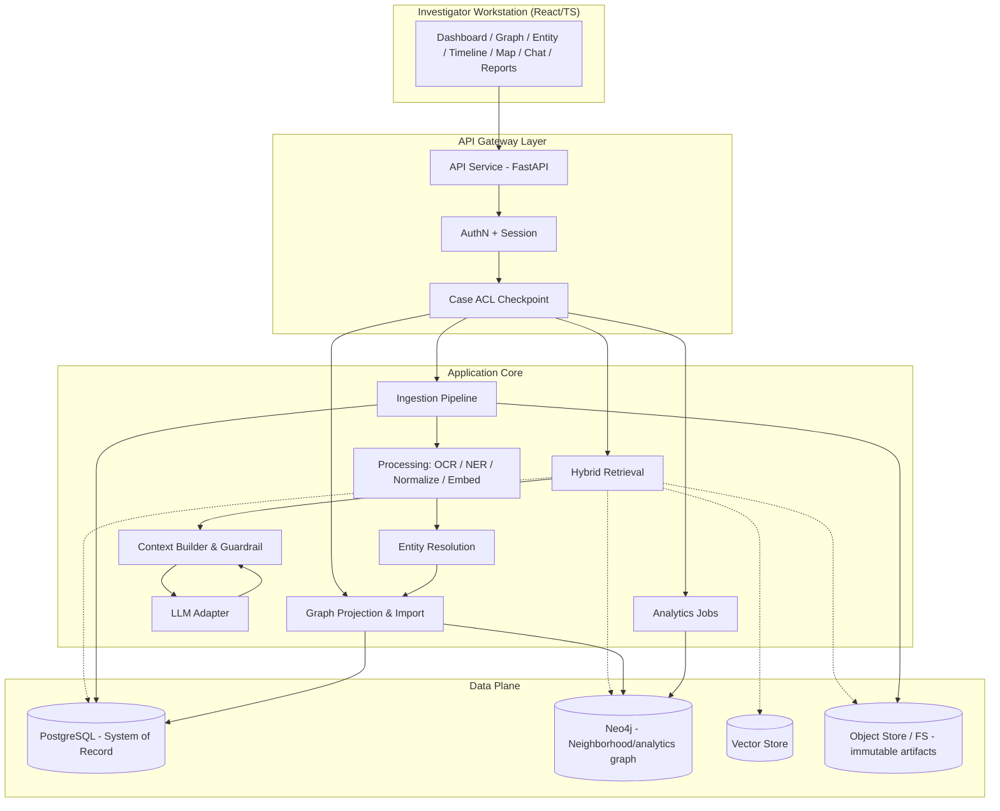
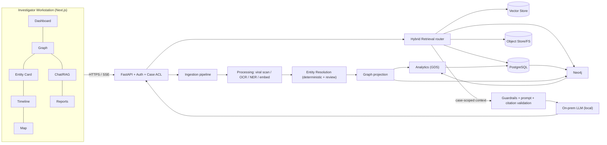

# SIH26189 — AI-Powered Criminal Network Analysis System

## Architecture Specification & Implementation Context

| Field | Value |
|---|---|
| Project | SIH26189 — AI-Powered Criminal Network Analysis System |
| Domain | Indian Law Enforcement / Criminal Investigation / Network Analysis |
| Doc type | Architecture specification (implementation context) |
| Status | Draft v1.0 — for team review before implementation |
| Scope | Hackathon MVP → secure on-prem/production evolution |

> **Source priority.** This document is written from the SIH26189 brief, the
> "Criminal Network Gap Analysis" and the "RAG / Criminal Network Analysis
> design notes" (summarised in this task). Where the source material is not
> attached to this working session, its contents are represented here via the
> authoritative requirements brief. Each requirement is tagged:
> **[SRC]** explicit source requirement, **[INF]** architectural inference,
> **[REC]** recommendation by this architecture review.

---

# PHASE 1 — Requirements Extraction

## 1A. Functional Requirements

### Ingest & Store

| ID | Requirement | Origin |
|---|---|---|
| FR-01 | Ingest FIRs from PDF, scanned image, and text; support Hindi/English/regional languages | [SRC] |
| FR-02 | OCR scanned/handwritten FIRs (with human-confirmation of low-confidence text) | [SRC] |
| FR-03 | Ingest CDR (calling/called number, timestamp, duration, cell, IMEI/IMSI) | [SRC] |
| FR-04 | Ingest IPDR (session start/end, IP, subscriber info) | [SRC] |
| FR-05 | Ingest financial/UPI/bank transaction records | [SRC] |
| FR-06 | Ingest tower dumps (device observed at tower + time) | [SRC] |
| FR-07 | Ingest CCTV metadata (camera, time, vehicle/plate) | [SRC] |
| FR-08 | Store the original artifact immutably; never lose the source | [SRC] |
| FR-09 | Track per-file ingestion status, retry failures, idempotent re-import | [SRC]/[REC] |

### Extract & Resolve

| ID | Requirement | Origin |
|---|---|---|
| FR-10 | Extract persons, phones, devices (IMEI/IMSI), accounts, places, vehicles, organizations from FIRs and notes | [SRC] |
| FR-11 | Entity resolution pipeline: normalization, exact/deterministic matching, fuzzy + contextual matching, confidence scores, candidate lists, human merge review, reversible merges | [SRC] |
| FR-12 | Never silently merge entities on name similarity alone | [SRC] |
| FR-13 | Preserve every extraction/merge decision with provenance | [SRC] |

### Model & Store Graph

| ID | Requirement | Origin |
|---|---|---|
| FR-14 | Build a POLE-style graph: Person, Object, Location, Event | [SRC] |
| FR-15 | Model communication, transactions, observations, co-location, crimes, FIRs, evidence — without losing event-level detail | [SRC]/[REC] |
| FR-16 | Enforce case scoping/isolation on the graph | [SRC]/[REC] |

### Analyse

| ID | Requirement | Origin |
|---|---|---|
| FR-17 | Community detection (Leiden/Louvain) | [SRC] |
| FR-18 | Centrality: degree, betweenness, eigenvector, PageRank | [SRC] |
| FR-19 | Shortest path, common neighbours, key-player analysis | [SRC]/[REC] |
| FR-20 | Temporal analysis: bursts, silence patterns, sequences | [SRC] |
| FR-21 | Geospatial analysis: co-location, movement via towers/CCTV | [SRC] |
| FR-22 | Cross-case correlation: same person/phone/device/account in multiple FIRs | [SRC] |
| FR-23 | Financial flow analysis (money paths, convergence) | [SRC]/[INF] |

### Query — Hybrid RAG

| ID | Requirement | Origin |
|---|---|---|
| FR-24 | Natural-language questions over the investigation | [SRC] |
| FR-25 | Hybrid retrieval: graph retrieval + vector/evidence retrieval + fusion | [SRC] |
| FR-26 | Deterministic questions answered by deterministic systems (graph/Db/analytics), LLM only interprets | [SRC] |
| FR-27 | Answer with structured citations/provenance back to source record | [SRC] |
| FR-28 | LLM must not invent facts, relationships, or references | [SRC] |

### Report & Workflow

| ID | Requirement | Origin |
|---|---|---|
| FR-29 | Generate traceable investigation reports with source references and audit metadata | [SRC] |
| FR-30 | Presentation views: case dashboard, graph, entity card, evidence panel, timeline, map, RAG chat, search, analytics, reports, audit | [SRC]/[REC] |
| FR-31 | Cross-view selection: selecting an entity shows context across all views | [SRC]/[REC] |

## 1B. Non-Functional Requirements

| ID | Requirement | Origin |
|---|---|---|
| NFR-01 | Handles thousands-to-millions of CDR/tower records; FIR count is low relative to records | [SRC]/[INF] |
| NFR-02 | Long-running ingestion must be asynchronous and monitorable (not blocking HTTP) | [SRC]/[REC] |
| NFR-03 | Graph queries bounded/paginated; UI renders subgraphs, not entire networks | [SRC]/[REC] |
| NFR-04 | Analytics snapshot-able; heavy algorithms run asynchronously on scoped subgraphs | [SRC]/[REC] |
| NFR-05 | Reproducible runs: same data + version → same analytical result | [REC] |
| NFR-06 | Audit trail for every ingestion, resolution, merge, query, report | [SRC] |
| NFR-07 | Available offline / air-gapped; no hard dependency on external cloud APIs | [SRC] |

## 1C. Security Requirements

| ID | Requirement | Origin |
|---|---|---|
| SEC-01 | Authentication (with MFA as production concern) | [SRC] |
| SEC-02 | RBAC + case-level ACL, least privilege, deny-by-default | [SRC] |
| SEC-03 | Authorization evaluated before any retrieval; LLM cannot override it (cross-case query must fail before context construction) | [SRC] |
| SEC-04 | Encryption in transit (TLS) and at rest (DB/object storage) | [REC]/[SRC] |
| SEC-05 | Secrets management; no secrets in code/repo | [REC] |
| SEC-06 | Audit logging: user actions, queries, admin actions, access denials | [SRC] |
| SEC-07 | Immutable evidence provenance; tamper-evidence design (hash chains/WORM storage) | [SRC]/[REC] |
| SEC-08 | File upload validation + malware scanning + parser isolation (untrusted documents) | [REC] |
| SEC-09 | Detect and contain prompt injection from uploaded documents | [SRC] |
| SEC-10 | Prevent data exfiltration, cross-case leakage, LLM information leakage | [SRC] |
| SEC-11 | Case/tenant isolation in every data plane (Postgres, Neo4j, vector store, LLM context) | [REC] |
| SEC-12 | Container/OS hardening; minimal images; no privileged containers for parsing | [REC] |
| SEC-13 | Key management for encryption; protection against administrator abuse (split audit) | [REC] |
| SEC-14 | Retention/deletion policy aligned to legal hold requirements | [REC] |

## 1D. Data Requirements

| ID | Requirement | Origin |
|---|---|---|
| DR-01 | Unified event model across heterogeneous sources (call, transaction, presence, observation) | [SRC]/[REC] |
| DR-02 | Raw artifacts stored immutably; derived data rebuildable | [SRC] |
| DR-03 | Every derived fact traceable: document → record → ingestion → extractor/model version → resolution → timestamp | [SRC] |
| DR-04 | Multi-format identifiers (phone with +91, IMEI, account numbers) normalized at ingestion | [SRC] |
| DR-05 | Temporal integrity: timestamps, durations, and event ordering preserved; never collapsed | [SRC] |
| DR-06 | Confidence and provenance as first-class properties, not comments | [SRC]/[REC] |

## 1E. AI/ML Requirements

| ID | Requirement | Origin |
|---|---|---|
| AM-01 | OCR for printed + handwritten (Hindi/English/regional) FIRs | [SRC] |
| AM-02 | NER for persons, organizations, places, phones, accounts, vehicles, dates | [SRC] |
| AM-03 | Entity resolution with explainable confidence | [SRC] |
| AM-04 | Text embedding for evidence retrieval (FIR narration, statements) | [SRC] |
| AM-05 | On-premise LLM (Mistral/Llama/Qwen-class) for Q&A/explanation | [SRC] |
| AM-06 | LLM constrained to interpret retrieved evidence, never to produce facts | [SRC] |
| AM-07 | Deterministic graph analytics (community/centrality/path) computed by algorithms, not the LLM | [SRC] |

## 1F. Hackathon (MVP) Requirements

| ID | Requirement | Origin |
|---|---|---|
| HM-01 | Live vertical slice: upload FIR → extract → upload CDR → parse → build graph → visualize → community → centrality → timeline → NL Q&A with citations → export report | [SRC] |
| HM-02 | Minimize infrastructure: no Kafka/Redis/K8s unless a concrete MVP need | [SRC]/[REC] |
| HM-03 | Precompute common graph answers / context in the demo rather than full production RAG | [SRC] |
| HM-04 | Work offline; demo with the bundled Pune/Mumbai sample dataset already present in `lib/data/raw/` | [INF]/[REC] |

## 1G. Future / Production Requirements

| ID | Requirement | Origin |
|---|---|---|
| PR-01 | Full vector retrieval and multilingual OCR/NLP | [SRC] |
| PR-02 | Dedicated on-prem LLM serving (air-gapped) | [SRC] |
| PR-03 | CCTNS / SAHYOG integration | [SRC] |
| PR-04 | Real-time / streaming ingestion | [SRC] |
| PR-05 | Scale-out processing, inter-agency workflow, stronger evidence chain and audit | [SRC] |
| PR-06 | Rich entity resolution (graph-based, human review UI) | [SRC] |

**Assumptions (open items).** Ink/handwriting OCR quality is unknown — plan a
human-review loop. Sample-data semantics ("Network internal" senders, burner
alias records) are demo fixtures produced for the hackathon. Schema of live
CDR/actual CCTNS exports is not captured in this brief — treat our field
mapping as a configurable contract.

---

# PHASE 2 — Contradictions & Weak Assumptions in the Existing Proposal

Critique of the technology list and design assumptions in the source material:

| # | Proposed assumption / choice | Challenge | Resolution in this architecture |
|---|---|---|---|
| C-01 | "Fuzzy matching is entity resolution" | Fuzzy string match on names is unsafe for identity decisions; `Rajesh Kumar` vs `R. Kumar` vs `RK Enterprises` are different entity *kinds*. Silent merges corrupt the graph permanently. | Multi-stage ER: deterministic identifiers first (phone/IMEI/account, normalized), fuzzy+contextual only to *propose candidates*, human approval, reversible merge, full provenance. |
| C-02 | "High centrality ⇒ kingpin" | Betweenness/PageRank are network-structure heuristics; a bank branch or a broker can be central without being the operator. Confusing indicator with fact biases investigation. | Analytics output tagged `kind=indicator`, `model`, `confidence`, and caveated in UI/reports. Never auto-label as "kingpin"; the sample `discoveries.json` already makes this a story, not a verdict. |
| C-03 | "LLM answers deterministic questions" | The LLM will hallucinate sums, paths, counts and cite nothing. | Query router classifies intent; deterministic intents are executed as Cypher/SQL/analytics; LLM parser receives only canonical results + retrieved evidence. LLM = explainer. |
| C-04 | "Neo4j stores everything" | Putting every raw record, blob, and audit event in the graph bloats the DB and couples analytics to graph cost. | Neo4j = queryable derived graph (entities/events/hypotheses). PostgreSQL = system of record (artifacts, jobs, audit, ACL). Object storage = immutable raw files. Vector store = evidence chunks. |
| C-05 | "One retrieval path for every question" | A single vector-recall pipeline returns chatty text for "who is connected to X". | Hybrid router: GRAPH / TEMPORAL / FINANCIAL / CROSS_CASE / ENTITY / DOC_SUMMARY / EVIDENCE / ANALYTICAL / HYBRID. |
| C-06 | "Overly big MVP" | Realistic MVP is a single vertical slice, not a full production platform. | MVP scope is locked (Phase 12); every future feature is explicitly deferred. |
| C-07 | "Sync ingestion in a request handler" | OCR+NER+embedding+ER in one REST call is unreliable and slow. | Async ingestion pipeline; each step idempotent, retryable, state-visible. |
| C-08 | "Graph schema oversimplification" | `A CALLED B` without event/record loses the forensic record; merges wipe evidence. | Event-authoritative modeling: raw records become Event nodes with evidence link; derivations are typed, reversible, provenance'd. |
| C-09 | "JWT alone = authorization" | A signed token proves identity, not entitlement to case data. | JWT = session only. Every data access re-checks case ACL at the data-plane boundary. Authorization before retrieval. |
| C-10 | "Vector search ≈ graph reasoning" | Embeddings capture lexical/semantic similarity, not relational truth. Similar texts ≠ connected people. | Graph facts come from the graph; vectors serve documents. Fused only after case-scoped candidate fetch. |
| C-11 | "Render the whole graph in the frontend" | 100k-node graphs kill the browser. | Server-side bounded expansion, pagination, viewport limiting, filters; Cytoscape only ever sees small subgraphs. |
| C-12 | "Generated reports are court-admissible" | A citation ≠ legal admissibility; OCR errors, JS signatures and model interpretation do not constitute forensic chain. | UI/report states clearly what it is ("investigative working copy"); no legal-admissibility claims without review by competent authority (CYBER/forensic lab). |
| C-13 | "LangChain solves everything / unnecessary services" | Blindly adding LangChain, Kafka, Redis, K8s for appearance creates failure modes. | Only add infrastructure with a named requirement. MVP: Postgres + Neo4j + filesystem(→ object store) + optional FAISS. No broker in MVP. |
| C-14 | "Trust extracted entities" | NER errors and OCR noise propagate into the graph as fake people. | Extraction results enter graph only as `Derived` nodes with confidence & human-review flags; rejected extractions don't pollute. |
| C-15 | "Audit logs solve accountability" | Logs edited by the same admin being audited are not tamper-evident. | Append-only + daily hash-chain anchor + separate retention; admin actions logged and signed. |
| C-16 | "10,000 records in seconds" (unqualified) | Meaningless without scope: bulk CSV *parse* vs graph *import* vs *query* vs *analytics*. | Every perf claim states workload, storage, and algorithm. Bounded expectations in Phase 15. |

---

# PHASE 3 — Architecture Principles

1. **Evidence first.** Raw source artifacts are immutable legal-of-record; everything derived is rebuildable.
2. **Deterministic before generative.** If a query can be answered by query/algorithm, the LLM never answers it.
3. **Authorization before retrieval.** Case ACL is enforced at the data plane, before context construction; the LLM cannot override it.
4. **Provenance by default.** No derived fact exists without a chain: source → record → ingestion → extractor/model/version → resolution → timestamp.
5. **Untrusted documents.** Every uploaded file is hostile input; parse in isolation, constrain model output.
6. **LLM is not the source of truth.** The LLM interprets retrieved evidence; it never invents entities, edges, numbers, or references.
7. **Human-reviewable entity resolution.** Merges are proposals with confidence, not silent facts; reversible with full audit.
8. **Facts vs indicators vs inferences.** The model distinguishes observed → extracted → resolved → derived → analytical → hypothesis → recommendation.
9. **Separate systems of record.** Neo4j = queryable derived model; Postgres = authoritative/operational record; store = immutable artifacts.
10. **Idempotent, resumable ingestion.** Pipelines can re-run without duplicates; partial failures resume.
11. **Case isolation by construction.** Every storage layer and every query carries a case-scope scoping key; no default "all cases".
12. **Small-slice MVP.** The demo is one self-contained vertical slice; production features exist only as seams, not implementations.
13. **Minimal infrastructure.** Add a service only when a concrete requirement forces it; favor boring, well-known components.
14. **Analytics are hypotheses.** Centrality/community outputs are investigative indicators with method, confidence, limitations; never auto-verdicts.
15. **Bounded UI.** The frontend always renders small, filtered subgraphs and paginated result sets.
16. **Reproducibility.** Pin models, extractors and data ingest versions; provenance captures them.
17. **Everything async except what must be sync.** Reads are sync; writes/OCR/NER/analytics/embedding/LLM are jobs with status.
18. **Least privilege & deny-by-default.** No role/action/case access unless explicitly granted; default query scope = current case.
19. **Fail loudly with re-mediation.** OCR/NER/LLM failures surface as actionable job states, never as silent empty results.
20. **Evolvable to air-gap.** Design the model plane as swappable local inference; no external-API dependency in the data path.

---

# PHASE 4 — High-Level Architecture

## 4.1 Component Context (Mermaid)



## 4.2 Layered View

```text
+----------------------------------------------------------------------------------+
|  CLIENT  React + TypeScript (Cytoscape.js, vis-timeline, Leaflet, chat UI)      |
+----------------------------------------------------------------------------------+
         |  HTTPS (REST + Server-Sent Events / WebSocket for job/stream UX)
+----------------------------------------------------------------------------------+
|  API / EDGE  FastAPI | auth | session | case-ACL checkpoint | rate-limit         |
+----------------------------------------------------------------------------------+
|  APPLICATION CORE                                                                 |
|  - orchestration: ingestion, processing, ER, analytics, retrieval, reports       |
|  - background jobs via worker pool (same codebase - queue in Postgres MVP)       |
|  - RAG: router -> retrievers -> fusion -> ranking -> evidence-packaging          |
+----------------------------------------------------------------------------------+
|  SERVICE BOUNDARIES (in-process modules in MVP, separable later)                 |
|  ingestion | ocr/nlp | entity-resolution | graph-import | analytics | retrieval  |
+----------------------------------------------------------------------------------+
|  DATA PLANE                                                                       |
|  PostgreSQL(system of record)  |  Neo4j(derived graph)  |  Vector store          |
|  Object store / FS (raw artifacts)  |  MinIO (prod)                             |
+----------------------------------------------------------------------------------+
|  MODEL PLANE   on-prem LLM (MVP: local/ quantized) | embedder | OCR engine       |
+----------------------------------------------------------------------------------+
```

## 4.3 Component Responsibilities

| Component | Responsibility | Trust tier |
|---|---|---|
| Web client | Views, cross-view selection, evidence drill-down, chat; never holds data authority | Untrusted (client) |
| API service | AuthN, case-scoped routing, DTO validation, orchestrating reads | Trusted edge |
| Case ACL checkpoint | Enforces `user → role → case` entitlement for every data-plane access | Trusted, critical |
| Ingestion pipeline | Validate → malware scan → store raw → parse → normalize → extract → resolve → import → index → analysis-queue | Trusted worker |
| Processing workers | OCR, NER, embedding, entity extraction (versioned models) | Trusted worker (parsers in isolation) |
| Entity resolution | Normalize, deterministic match, candidates, scoring, human review, merge/revert | Trusted |
| Graph import | Projection from Postgres/events → Neo4j; provenance props | Trusted |
| Analytics | GDS community/centrality/path/temporal runs; snapshots; advisory results | Trusted |
| Hybrid retrieval | Intent routing + case-scoped graph/vector search + fusion + ranking + dedupe | Trusted |
| Context builder / guardrail | Assemble prompt from **retrieved** context only; validate citations before output | Trusted, critical |
| LLM adapter | Call on-prem model with no external deps; enforce output contracts only | Untrusted output (post-validated) |
| PostgreSQL | Users, roles, ACL, cases, files, jobs, evidence/provenance, audit, reports | System of record |
| Neo4j | Canonical entities/events/derivations; graph analytics | Query plane |
| Object store | Versioned raw artifacts, WORM/hash-anchored | Record of evidence |
| Vector store | Embeddings of evidence chunks (scoped by case) | Query plane |

## 4.4 Trust Boundaries (explicit)

```text
[Client] --TLS--> [API+Auth+ACL] --internal TLS--> [Data Plane]
                                                  |
            [Processing Workers] --isolated parse env--> [LLM plane]  (no direct client access)
```

- Clients never reach the data plane or LLM directly.
- Parsers (OCR) run isolated from the authoritative store; they can only write via ingestion API.
- LLM runs with a strict "retrieve-then-answer" contract and no live tool/DB access in MVP.

---

# PHASE 5 — Detailed Data Architecture

## 5.1 Ownership Matrix — which system stores what

| Data object | System of record | Index/query copies | Notes |
|---|---|---|---|
| Raw artifacts (PDFs, images, CSVs, binary) | Object store (MVP: FS under `storage/raw/`) | Neo4j `Document` node (metadata only) | Immutable; content-hash filename |
| Source records (CDR/IPDR/txn rows) | PostgreSQL `source_records` | Neo4j Event nodes (projection) | Rebuildable from Postgres |
| Files/version metadata | PostgreSQL `files` | — | GUID, hash, size, checksum, status |
| Users, roles, case ACLs | PostgreSQL | — | Never in graph |
| Extracted entities & evidence | PostgreSQL + Neo4j | Neo4j `DerivedEntity` | Both; Postgres is record |
| Resolved canonical entities | PostgreSQL `entities` (record) + Neo4j labels | Neo4j | Postgres owns identity; Neo4j owns neighborhood |
| Merge/candidate decisions | PostgreSQL `entity_resolution_candidates`, `entity_resolution_decisions` | — | Reversible |
| Graph (neighborhood, paths, communities) | Neo4j (derived, rebuildable) | — | Re-import pipeline from source tables |
| Analytics runs & results | PostgreSQL `analytical_runs`, plus Neo4j projected snapshots | — | Model + params + graph-version pinned |
| Embeddings of evidence chunks | Vector store + PostgreSQL `evidence_chunks` (text/provenance) | — | Case partition; rebuildable |
| Audit + query log | PostgreSQL `audit_logs`, `query_logs` | — | Append-only + hash chain |
| Reports | PostgreSQL `reports` (metadata) + object store (rendered artifact) | — | Traceability metadata embedded |

## 5.2 Core Entity Catalogue

| Entity | Stores | Kind |
|---|---|---|
| SourceArtifact / Document | obj store + Postgres | observed evidence |
| Record<Source> (per-source raw row) | Postgres | observed evidence |
| EvidenceChunk | vector store + Postgres | observed evidence (splits) |
| Case | Postgres (+Neo4j `Case`) | organizational |
| Person, Organization | Postgres + Neo4j | canonical entity |
| Phone, Device (IMEI/IMSI), Vehicle, Account | Postgres + Neo4j | canonical identity-holder |
| Location/Tower/Camera | Postgres + Neo4j | canonical entity |
| FIR/Crime/Incident | Postgres + Neo4j | canonical + event |
| CommunicationEvent / TransactionEvent / PresenceObservation / LocationObservation | Postgres (records) + Neo4j (Event nodes) | observed event |
| Connection (derived relationship) | Neo4j | derived relationship |
| AnalyticalResult | Postgres + Neo4j | analytical result |
| Inference / Hypothesis | Neo4j (`Inference`) + Postgres | inference |
| Recommendation / Note | Postgres | recommendation |

## 5.3 Fact–Kind Spectrum (enforced in schema)

```text
OBSERVED  (record/artifact in Postgres+store, immutable)
   ↓ extraction (model, version)
EXTRACTED (Document/Record fields; confidence; reviewed flag)
   ↓ resolution (deterministic then reviewed fuzzy)
RESOLVED  (canonical entity/edge; reversible merge)
   ↓ projection/derivation
DERIVED   (event nodes, aggregated edges; rebuildable)
   ↓ algorithms
ANALYTICAL (community/centrality/path results; params pinned)
   ↓ interpretation
INFERENCE (hypothesis node with supporting evidence refs)
   ↓ recommendation
RECOMMENDATION (human-authored or constrained suggestions)
```

Each element carries `kind`, `confidence`, `provenance`, `case_id`, `created_at`, `created_by`.

---

# PHASE 6 — Neo4j Graph Schema

## 6.1 Design Rationale

- **Event-authoritative model:** raw observations are Event nodes, not naked edges, so we never lose records, times, or per-event evidence.
- **Canonical entities** (Person/Phone/Device/Vehicle/Location/Organization/Account/FIR/Case/Document) hold identity.
- **Derived relationships** (aggregate `CALLED`, `TRANSACTED_WITH`, `KNOWS`, …) are typed edges with `derived=true`, `confidence`, `source_event_ids[]`, `window_start/end`; they are recomputable and reversible.
- **Evidence nodes** link entities/events to documents and source records.

## 6.2 Node Labels & Key Properties

| Label | Key properties | Purpose |
|---|---|---|
| `Case` | `case_id`, `name`, `status`, `owner_org` | scope root |
| `Person` | `id`, `primary_name`, `aliases[]`, `dob`, `gender`, `national_id`, `status` | canonical person |
| `Organization` | `id`, `name`, `type` | canonical org |
| `Phone` | `id`, `number_norm`, `operator`, `subscriber`, `activation` | canonical phone (E.164 normalized) |
| `Device` | `id`, `imei`, `imsi`, `model` | canonical device |
| `Vehicle` | `id`, `reg_no`, `type` | canonical vehicle |
| `Account` | `id`, `account_norm`, `bank`, `ifsc`, `holder` | financial account |
| `Location` | `id`, `kind` (tower/camera/address/gps), `lat`,`lng`, `landmark`, `cell_id` | canonical location |
| `FIR` | `id`, `fir_no`, `year`, `district`, `category`, `sections[]`, `narrative_id` | crime/an FIR |
| `Document` | `id`, `artifact_id`, `doc_type`, `checksum`, `ocred` | source document |
| `Record` | `record_kind` (cdr/ipdr/financial/tower/cctv), `source_file`, `row_idx` | source record pointer |
| `CommunicationEvent` | `event_id`, `dir`, `ts_start`, `ts_end`, `dur_sec`, `call_type`, `imei` | call/sms event |
| `TransactionEvent` | `txn_id`, `ts`, `amount`, `method`, `bank`, `branch`, `remark` | financial event |
| `PresenceObservation` | `ts`, `event` (from tower dump), `telephony identity` | presence |
| `LocationObservation` | `ts`, `camera`, `plate`, `observation_type` | CCTV metadata |
| `Evidence` | `id`, `source_type`, `source_ref`, `page`, `span`, `confidence`, `note` | provenance anchor |
| `AnalyticalResult` | `id`, `analysis_type`, `params`, `model_version`, `ran_at` | pinned analysis output |
| `Inference` | `id`, `hypothesis`, `support[]`, `confidence`, `status` | hypothesis, human-vis |

## 6.3 Relationship Types

| Relationship | Source → Target | Semantics | Properties |
|---|---|---|---|
| `IN_CASE` | any → Case | case scope for every node | — |
| `APPEARS_IN` | Person → FIR | mentioned/extracted in FIR | `mention_type`, `confidence`, `evidence[]` |
| `CALLED` (derived) | Phone → Phone | aggregate comm | `count`, `first_ts`, `last_ts`, `total_dur`, `derived=true`, `events[]` |
| `COMMUNICATED` (event) | CommunicationEvent → Phone | record-level call | `ts`, `dir`, `dur`, `call_id` |
| `TXN` (derived) | Account → Account | aggregate money flow | `count`, `sum`, `first/last`, `derived=true`, `events[]` |
| `TRANSACTION` (event) | TransactionEvent → Account | record-level | `amount`, `ts`, `method`, `txn_id` |
| `TRANSFERRED_TO` | Account → Account | strong deriv. edge (intermediary) | `via[]`, `sum`, `hops` |
| `PRESENT_AT` | Phone/Device → Location | co-location | `ts`, `event`, `dump_id` |
| `OBSERVED_AT` | Vehicle → Location | CCTV | `ts`, `camera`, `plate` |
| `USES` | Person → Phone | possession | `confidence`, `evidence[]`, `derived=true` |
| `OWNS` | Person → Device/Account/Vehicle | ownership | `confidence`, `evidence[]` |
| `LOCATED_AT` | Person → Location | residence | `evidence[]` |
| `INVOLVED_IN` | Person → FIR/Crime | involvement | `role`, `confidence`, `evidence[]` |
| `RELATES_TO` | FIR → FIR | cross-case correlation | `basis[]` (shared persons/phones/accounts) |
| `KNOWS` (derived) | Person → Person | inferred strong tie (review required) | `basis[]`, `score`, `derived=true` |
| `MENTIONED_IN` | any → Document/Record | extraction provenance | `extractor`, `version`, `span` |
| `EVIDENCE_OF` | Evidence → source node | provenance anchor | — |
| `PRODUCED` | AnalyticalResult → subgraph/nodes | analysis attribution (edges to members or `-> Union`) | `params`, `version` |
| `SUPPORTS` / `SUGGESTS` | Inference → Evidence/Event | hypothesis support | `weight`, `confidence` |

> ACID rule: **never put a source record's row into the graph without its `Record` pointer**; merging/fuzzy edges are always `derived=true` and reviewable.

## 6.4 Provenance Strategy

Every node/edge created from data carries a **provenance object** stored as properties:

```text
provenance: {
  case_id, ingestion_job_id, source_file_id, source_record_id,
  extractor: {name, version}, project_version,
  created_at, created_by, derivation: "observed|extracted|resolved|derived|analytical|inference",
  provenance_hash            # HMAC over canonical fields (tamper-evident)
}
```

Edges additionally store `evidence[]` = list of `Evidence` node ids, and `confidence`.

## 6.5 Temporal Strategy

- Try to keep Unix epoch millis `ts_start`/`ts_end` plus original string `ts_raw` and `tz` when provided.
- All time-ordered queries use `ts_*` indexed properties.
- Time windows used for "silence", "burst", "24h before X" are **range scans** on these indexed properties, not path scans.
- Event nodes retain order; derived edges carry `first_ts/last_ts/count`.

## 6.6 Case Isolation Strategy

- Every node/edge gets `IN_CASE` relationship to its `Case`.
- Every read starts with `MATCH (n)-[:IN_CASE]->(:Case {case_id:$caseId})` guard (WHERE clause plus query-parameterized case_id).
- No Cypher executes without a case_id lifecycle param; API layer injects `case_id` from ACL, never trusts the client.
- Cross-case correlation is a **separate, permissioned read API** (`/graph/cross-case`) that queries only the intersection of authorized cases.

## 6.7 Indexes & Constraints

```cypher
CREATE CONSTRAINT case_uid IF NOT EXISTS FOR (c:Case) REQUIRE c.case_id IS UNIQUE;
CREATE CONSTRAINT person_uid IF NOT EXISTS FOR (p:Person) REQUIRE p.id IS UNIQUE;
CREATE CONSTRAINT phone_norm IF NOT EXISTS FOR (p:Phone) REQUIRE p.number_norm IS UNIQUE;
CREATE CONSTRAINT device_imei IF NOT EXISTS FOR (d:Device) REQUIRE d.imei IS UNIQUE;
CREATE CONSTRAINT acct_norm IF NOT EXISTS FOR (a:Account) REQUIRE a.account_norm IS UNIQUE;
CREATE CONSTRAINT fir_no IF NOT EXISTS FOR (f:FIR) REQUIRE f.fir_no IS UNIQUE;
CREATE CONSTRAINT loc_cell IF NOT EXISTS FOR (l:Location) REQUIRE l.cell_id IS UNIQUE;
CREATE CONSTRAINT evt_id IF NOT EXISTS FOR (e:CommunicationEvent) REQUIRE e.event_id IS UNIQUE;
CREATE INDEX person_name IF NOT EXISTS FOR (p:Person) ON (p.primary_name);
CREATE INDEX person_alias IF NOT EXISTS FOR (p:Person) ON (p.aliases);
CREATE INDEX evt_ts IF NOT EXISTS FOR (e:CommunicationEvent) ON (e.ts_start);
CREATE INDEX evt_ts_end IF NOT EXISTS FOR (e:CommunicationEvent) ON (e.ts_end);
CREATE INDEX txn_ts IF NOT EXISTS FOR (t:TransactionEvent) ON (t.ts);
CREATE INDEX pres_ts IF NOT EXISTS FOR (o:PresenceObservation) ON (o.ts);
CREATE INDEX rel_case IF NOT EXISTS FOR ()-[r:IN_CASE]-() ON (r.case_id);
CREATE INDEX n_confidence IF NOT EXISTS FOR (n:Person) ON (n.confidence);
```

> Same-uniqueness caveat: phone/IMEI/account are unique **within the resolution registry**, not per raw record; raw records live in Postgres and reference `number_norm`.

## 6.8 Representative Investigative Cypher

```cypher
// 1. Who is connected to Rajesh Kumar (within authorized case)?
MATCH (p:Person)-[:USES]->(:Phone)-[c:CALLED]-(:Phone)<-[:USES]-(o:Person)
WHERE p.primary_name CONTAINS 'Rajesh'  AND (c.case_id = $caseId)
RETURN o.primary_name, count(c) AS n, sum(c.total_dur) AS dur
ORDER BY n DESC LIMIT 25

// 2. Which suspects appear in multiple FIRs?
MATCH (p:Person)-[r:INVOLVED_IN]->(f:FIR)
WITH p, count(DISTINCT f) AS fir_count, collect(DISTINCT f.fir_no) AS firs
WHERE fir_count >= 2
RETURN p.primary_name, fir_count, firs ORDER BY fir_count DESC

// 3. Shortest path between A and B (money only)
MATCH path = shortestPath((a:Person)-[*..6]-(b:Person))
WHERE a.id = $idA AND b.id = $idB
RETURN extract(n IN nodes(path) | coalesce(n.primary_name, n.number_norm, n.id)) AS route

// 4. Money moved between two accounts (deterministic aggregation)
MATCH (a:Account {account_norm:$from})-[t:TXN]->(b:Account {account_norm:$to})
RETURN a.account_norm, b.account_norm, t.sum AS total, t.count AS txns

// 5. What happened in the 24 hours before the incident timestamp $T at location $loc?
MATCH (e) WHERE e:CommunicationEvent AND e.ts_start >= $T-86400000 AND e.ts_start <= $T
  AND (e)-[:IN_CASE]->(:Case {case_id:$caseId})
RETURN e.event_id, e.ts_start, e.duration_sec ORDER BY e.ts_start DESC

// 6. Why does A connect to B? → pull edge evidence
MATCH (a)-[r]->(b)
WHERE a.id=$idA AND b.id=$idB AND ($rtype IS NULL OR type(r)=$rtype)
RETURN type(r), r.confidence, r.provenance, r.evidence, r.derived
```

## 6.9 GDS / Analytics Runtime

- MVP uses **Neo4j Graph Data Science (GDS)** in-memory projected graphs over a **case-scoped subgraph** (`g.graph.filter` by `IN_CASE`).
- Analytical runs record: graph projection params, algorithm+params, model/library version, wall time, node count → reproducible.
- Deterministic structural metrics (degree, betweenness-approx, Leiden membership, PageRank) output to `AnalyticalResult` nodes and Postgres `analytical_runs`, never overwrite canonical data.

---

# PHASE 7 — PostgreSQL Schema

PostgreSQL is the **system of record**. Key tables (ownership, keys, purpose). MVP uses one DB; production may separate audit into its own instance.

```text
┌───────────────┐     ┌───────────────┐     ┌───────────────┐
│  identity      │     │  operational   │     │  evidence      │
│  users/roles   │     │  cases/files   │     │  artifacts     │
│  orgs          │     │  ingestion     │     │  records       │
│  case_acl      │     │  jobs          │     │  chunks        │
└───────────────┘     └───────────────┘     └───────────────┘
┌───────────────┐     ┌───────────────┐     ┌───────────────┐
│  analyses     │     │  audit/media   │     │  reports       │
│  er_candidates│     │  audit_logs    │     │  reports_meta  │
│  runs         │     │  query_logs    │     │  report_assets │
└───────────────┘     └───────────────┘     └───────────────┘
```

## 7.1 Tables

| Table | Purpose | Keys / notes |
|---|---|---|
| `users` | personnel accounts | PK `user_id`; unique `username`, `email`; argon2 hash; `otp_enabled` (prod) |
| `roles` | RBAC roles | PK `role_id`; e.g. `admin`, `analyst`, `investigator`, `viewer`, `reviewer` |
| `user_roles` | many-to-many roles | FK `user_id`,`role_id` |
| `organizations` | agency/unit | PK `org_id` |
| `cases` | investigation scope | PK `case_id`; `name`, `status`, `owner_org_id`, `created_by`, `archived_at` |
| `case_members` | case-level ACL | FK `case_id`,`user_id`; `role`; `access_scope` (write/read/review) |
| `files` | upload/artifact registry | PK `file_id`; `case_id`, `name`, `size`, `content_hash` (sha256), `storage_path` (obj store key), `mime`, `virus_status`, `status`, `uploaded_by` |
| `ingestion_jobs` | pipeline run | PK `job_id`, FK `case_id`,`file_id`; `pipeline_version`, `state` (queued/running/succeeded/failed/partial), `error`, `processed_rows`, `total_rows`, `started_at`, `finished_at` |
| `ingestion_steps` | per-step status | FK `job_id`; `step_name`, `state`, `retries`, `result_ref` |
| `source_records` | normalized raw rows (CDR/IPDR/financial/tower/CCTV) | PK `record_id`; `case_id`, `file_id`, `row_idx`, `data jsonb`, `normalized jsonb`, `checksum` (dedupe), unique `(file_id,row_idx)`; `ingested_at` |
| `evidence_chunks` | text splits + provenance | PK `chunk_id`; `case_id`, `file_id`, `doc_id`, `doc_type`, `text`, `offset`, `page`,`meta jsonb`; `embedding_ref` |
| `documents` | FIR/statement/other docs | PK `doc_id`; `case_id`, `file_id`, `doc_type`, `text_raw`, `text_ocred`, `lang`, `ocr_model`, `extraction jsonb` |
| `entities` | canonical entity registry | PK `entity_id`; `entity_type`, `display_name`, `normalized jsonb` (phones/imeis/accounts), `status` (active/merged/obsolete), `merged_into_id` |
| `entity_resolution_candidates` | proposed merges | PK `cand_id`, FK `entity_a`,`entity_b`; `score`, `method`, `evidence`, `state` (pending/accepted/rejected) |
| `entity_resolution_decisions` | human/auto decisions | PK `decision_id`, `entity_id`,`candidate_id`, `decision`, `by_user`, `at`, `provenance` |
| `analytical_runs` | analysis history | PK `run_id`, FK `case_id`; `analysis_type`, `params jsonb`, `graph_snapshot_id`, `model/library versions`, `duration_ms`, `rowcount`, `result jsonb` |
| `reports` | report metadata | PK `report_id`, `case_id`, `scope jsonb`, `generated_by`, `generated_at`, `status`, `asset_ref` |
| `audit_logs` | append-only audit | PK `row_id`; `ts`, `user_id`, `action`, `resource_type`, `resource_id`, `case_id`, `ip`, `delta jsonb`, `prev_hash`, `hash` (chained) |
| `query_logs` | RAG/graph queries for tuning/audit | PK `qid`; `user_id`,`case_id`,`query_text`,`intent`,`retrieved ids`,`latency_ms`,`answered bool`,`feedback` |
| `notifications` / `jobs` (MVP queue) | background job queue | `job_id`, `queue`, `payload`, `state`, `attempts`, `run_at`, `locked_by` (Postgres-as-queue; swap for Redis/PG later) |
| `refresh_tokens` / `sessions` | auth sessions (prod) | PK `id`; FK user; `expires_at`, `revoked` |

## 7.2 Key invariants

- `source_records` rows are immutable after insert; any correction is a new version with `superseded_by`.
- `entity_resolution_decisions` are append-only; a merge can be reversed by a later decision, never deleted.
- `audit_logs` chain: each row `hash = H(prev_hash ‖ row_content ‖ secret)`. Daily anchor uploaded to object store; admin edits detectable by re-chaining.
- `case_id` column on every data table; every query plan enforces `case_id` filter (tested via indexing + policy).

## 7.3 Enforced via indices

```sql
CREATE UNIQUE INDEX idx_audit_chain ON audit_logs(row_id, prev_hash);
CREATE INDEX idx_records_case_row ON source_records(case_id, file_id, row_idx);
CREATE INDEX idx_files_case_status ON files(case_id, status);
CREATE INDEX idx_jobs_case_state ON ingestion_jobs(case_id, state);
CREATE INDEX idx_er_cand_state ON entity_resolution_candidates(state, score);
CREATE INDEX idx_sr_data_gin ON source_records USING gin(data jsonb_path_ops);
```

---

# PHASE 8 — RAG Architecture

## 8.1 Query Routing & Intent Extraction

| Intent | Example | Retrievers | Deterministic executor |
|---|---|---|---|
| GRAPH_QUERY | "Who is connected to Rajesh Kumar?" | graph neighborhood | Cypher |
| TEMPORAL_QUERY | "What happened in the 24h before the robbery?" | graph events (ts range) | Cypher |
| FINANCIAL_QUERY | "How much money moved between A and B?" | graph TXN edges | Cypher aggregation |
| ANALYTICAL_QUERY | "Who is most central?" | graph analytics snapshot | GDS result read |
| ENTITY_LOOKUP | "Where is account 342000108759?" | graph entity + evidence | Cypher + chunk |
| CROSS_CASE_QUERY | "Which suspects appear in multiple FIRs?" | graph cross-case (permitted intersection) | Cypher |
| DOCUMENT_SUMMARY | "Summarize FIR #23" | vector chunks + document | — (LLM summarize retrieved) |
| EVIDENCE_QUERY | "Why do you think A→B?" | graph edge evidence + chunks | hybrid |
| HYBRID_QUERY | "What can we infer about the network?" | graph + vector | hybrid |
| UNSUPPORTED | out-of-scope/adversarial | none | reject with apology+scope note |

Router = a small, deterministic classifier (intent keywords + entity cues), optionally LLM-assisted. **Intent classification must be case-scoped typed before any retriever fires.**

## 8.2 Retrieval Pipeline (end-to-end sequence, text)

```text
Officer                          API/RAG                            Retrievers              LLM
   |  NL question                   |                                    |                  |
   |-------------------------------►|                                    |                  |
   |                                | ACL check (case_id from session)   |                  |
   |                                | intent classify + entity extraction |                  |
   |                                | case_id injected (never from text)  |                  |
   |                                |-----(scoped) graph query──► Neo4j   |                  |
   |                                |◄---- canonical results              |                  |
   |                                |-----(scoped) vector search──► VS    |                  |
   |                                |◄---- chunks + evidence refs         |                  |
   |                                | fuse ─ rank ─ dedupe ─ budget       |                  |
   |                                | package context (cap size)          |                  |
   |                                | build prompt ONLY from context       |                  |
   |                                |→ answer + citations──────────► LLM  |                  |
   |                                |◄──── draft answer                    |                  |
   |                                | citation validation (every ref must |                  |
   |                                |  exist in retrieved set)            |                  |
   |                                | policy/guardrail pass                |                  |
   |◄──────── SQL: answer + cited evidence list ─────|                     |                  |
```

## 8.3 Retrieval Components

| Component | Role |
|---|---|
| Intent router | normalize/multilingual query, pick executor, emit intent + confidence |
| Entity/scope extractor | pull person/phone/account/case cues from query; resolves to canonical ids via ER service; demands user confirmation when ambiguous |
| Authorization interceptor | injects `case_id` (from session ACL), falsify if unsupported/unauthorized; **runs before any data read** |
| Graph retriever | parameterized Cypher (neighborhood, paths, events, analytics snapshots), bounded depth/pagination |
| Vector retriever | case-partitioned embedding search over `evidence_chunks` (MVP: FAISS index per case) |
| Evidence retriever | fetch `Evidence`/`Record`/`Document` provenance for candidates |
| Context fusion | combine canonical + evidence; dedupe by anchor id; drop low-confidence when budget exceeded |
| Context budget | hard token ceiling (e.g. 8k); truncation at evidence granularity, never mid-record |
| Prompt builder | system prompt: "answer only from context; cite by `[evidence:<id>]`; if insufficient, say so"; no literal reproduction of untrusted text directives unless plainly presented as quoted document text |
| LLM adapter | on-prem/local model; temperature→0; JSON/constrained output; no external network |
| Citation validator | verifies every `evidence:<id>`/source_id citation exists in the retrieved set before returning |
| Response validator | rejects answers making numbers/paths/counts that contradict canonical context; re-prompts or flags |

## 8.4 Prompt-Injection Defense (design)

- Documents and their NER text are **data, not instructions**: chunk text is enclosed as `[DOCUMENT text="…"]`, direct object names separated from model instructions by delimiters; any "ignore previous instructions" content is treated as document text.
- System prompt hard-locks: (1) never change case scope, (2) never reveal other cases, (3) never deny-then-execute conflicting instruction, (4) citations only from provided context.
- Retrieval-time injection filter: flag chunks containing instruction-like patterns (rare for FIRs/statements; present in OSINT dumps) and exclude or quote.
- Output filter: deny lists + "I cannot" fallback when requested action is out-of-scope; post-validation catches fabricated references.

## 8.5 Answer Contract

```json
{
  "answer": "string",
  "intent": "GRAPH_QUERY",
  "confidence": 0.93,
  "citations": [
    {
      "evidence_id": "EV-8841",
      "source_type": "cdr",
      "source_file": "cdr_pune_2023.csv",
      "record_id": "C009745",
      "page": null,
      "ts": "2023-01-01T09:55:00",
      "relationship_id": "rel-77",
      "evidence_span": "call 60s caller=9114997360 receiver=8809632712",
      "provenance": {"job": "J-12", "pipeline": "p1.3"},
      "confidence": 0.99
    }
  ],
  "deterministic_evidence": {"nodes": [{"id": "P-12", "label": "Rajesh Kumar"}], "edges": []},
  "warnings": ["centrality is an indicator, not proof of leadership"]
}
```

---

# PHASE 9 — Security Architecture

## 9.1 Trust Boundaries & Zones

```text
[MZ: Browser]   Internet/DMVZ  → API/edge only
[DMZ]          API service, static UI, terminated TLS
[CNZ]          App core, DBs, vector store, object store, workers — no internet egress
[Gap]          Air-gap: LLM served locally, embedding local, no cloud model calls
[Admin]        Split: sysadmin (systems) vs security officer (audit) — no single all-powerful
```

## 9.2 Security Controls Matrix

| Concern | Control |
|---|---|
| Authentication | Argon2id password hashing; JWT access (short TTL) + refresh; MFA TOTP (prod); session revocation server-side |
| Authorization | RBAC capability matrix + case ACL; deny-by-default; **every** resource access keyed on `case_id` from session |
| Case isolation | `case_id` injected at API gate; separate Neo4j/vector partitions; cross-case API only over authorized case intersection |
| Least privilege | Roles: `viewer < investigator < analyst < reviewer < case-admin < sysadmin`; read/write split; `admin` cannot decrypt evidence without separate key |
| Network | TLS 1.3 everywhere; ingress to API only; CNZ no egress; DB port firewalled |
| File security | Validate extension/mime, size caps, magic-byte sniff, SHA-256, AV scan (ClamAV prod), quarantine + deep-scan step; files stored with random names in object store |
| Parser isolation | OCR/NLP run in sandboxed containers (no network, memory/CPU limits, seccomp); output is plain text only |
| Model security | Model never receives untrusted instructions as commands (8.4); local models; `temperature=0`; constrained JSON schema output |
| Prompt injection | Document delimiters, instruction/data separation, injection filter, output validation (Phase 8.4) |
| Secrets | Env-injected via init + secret manager in prod; never in repo; rotation; per-env keys |
| Encryption at rest | Postgres TDE or filesystem-level (LUKS/managed), Neo4j at-rest encryption, object-store SSE, secrets sealed |
| Encryption in transit | TLS; internal mTLS in prod |
| Evidence integrity | Immutable artifact + content-hash; audit hash chain; write-once store policy (WORM buckets) |
| Audit & query log | Append-only logs, chained hashes, daily anchor; query logs for RAG + data reads; access-denial events logged |
| Administrator abuse | Split-admin; evidence decryption requires key holder + audited action; replay of evidence via dual control |
| Retention | Legal-hold aware retention policy per case/status; scheduled purge with audit |
| Container security | Minimal images, non-root, read-only FS where possible, no host mounts for parsers, image signing, pinned tags |
| Supply chain | Lockfiles, pin deps, SBOM (prod), vendor/CVE scan in CI, no dynamic installs in prod images |

## 9.3 Threat Model (categories → mitigations)

| Threat | Vector | Mitigation |
|---|---|---|
| Credential theft | phishing/reuse | MFA, short tokens, session revoke, throttling |
| Insider abuse | analyst/admin | case scope enforced server-side, split roles, audit +
decryption keys held separately |
| Cross-case exfiltration | RAG prompt, API | authorization before retrieval; cross-case auto-denied unless permissioned API |
| Prompt injection | uploaded FIR/OSINT text | instruction/data separation, injection filter, validator |
| LLM hallucination/fabricated citations | NL query | retrieval-only context; citation validator; deterministic fallback for numbers |
| Data tampering | DB admin, file write | immutability + hash chains, WORM, dual control |
| Malicious upload | phishing/doc macros | sanitize to text/images; parser sandbox; AV; no active content exec |
| DoS/query abuse | graph queries | parameterized Cypher, timeouts, rate limits, pagination, limited depth |
| Secrets leak | config/repo | no secrets in code; env + vault; pre-commit scan |
| Unauthorized OSINT/network hops | LLM "helpful" tool use | model has no tools in MVP; no network egress from CNZ |
| Backup theft | physical/media | encryption at rest + key separation |

---

# PHASE 10 — Failure Handling

| Failure | Behavior | Recover |
|---|---|---|
| OCR fails / low-confidence text | job `step` state → `failed` or `partial`; document flagged for human re-entry; confidence < threshold skips auto-extraction | Retry with other engine/language; manual OCR correction workflow |
| NLP extraction fails | no derived nodes created; extraction `failed`; FIR remains uploaded (document usable for summary RAG) | Re-run extraction on retry; versioned model pin |
| Entity resolution ambiguous | candidates created (state=pending), no auto-merge; UI review queue; search still works per-candidate | Investigator resolves/rejects; decision logged |
| Neo4j unavailable | read APIs degrade to Postgres-backed evidence/records (limited graph features); graph APIs return 503 with retry-after | health-check + connection pool; restart; parallel replica in prod |
| Vector store unavailable | RAG falls back to keyword/scoped full-text search over `evidence_chunks`; DOC_SUMMARY still possible | rebuild index from Postgres |
| LLM unavailable | RAG returns the **retrieved context + canonical results** with an "LLM unavailable — raw evidence" mode; deterministic intents unaffected | retry with backoff; swap model endpoint |
| Ingestion partially fails | per-step state; `partial` jobs visible; succeeded steps committed; failed steps retryable (idempotent by row checksum) | re-run job; resumable cursor |
| Duplicate file uploaded | content-hash → dedupe, returns existing file_id; no second import (or explicit "re-import as new version") | idempotency via `files.content_hash` |
| Malicious file | primary scan → quarantine; upload rejected; incident audit entry | virus DB update; re-scan |
| Graph query timeout | bounded timeouts (e.g. 3–5 s); response: suggest narrower scope; error surfaced not swallowed | index tuning, precomputed answers |
| Huge graph returned | server caps expansion (depth, per-hop limit), pagination; UI renders windowed view | granular fetch; frontend virtualization |
| Model generates unsupported claim/citation | citation validator drops/rejects; response flagged `needs_review`; deterministic contradicting canonical context wins | re-prompt with corrective instruction |
| Admin/credential attack detected | conditional lockout, urgent-alert audit, session revoke | incident response runbook |

**General rules:** every failure is an auditable event; jobs are resumable; the UI never shows "no data" when the truth is "job failed"; errors include job ids and retry affordance.

---

# PHASE 11 — API Architecture

## 11.1 API Domains (versioned `/api/v1`)

```text
/auth        login, refresh, logout, me
/cases       list, create, members, acl
/files       upload (multipart, streamed), list, status, download (authorized)
/ingestion   start (returns job), jobs, jobs/{id}, retry, status events (SSE)
/entities    search, get, attributes
/entity-resolution  candidates list, decision accept/reject, merge info
/graph       neighborhood, expand, path, cross-case (permissioned), subgraph
/analytics   run, runs, snapshot, results read
/timeline    events in window (filtered scope)
/geospatial  map data (towers, observations)
/search      full-text + vector scoped search
/rag         ask (streamed SSE), intent routes, answer history
/evidence    evidence/{id}, provenance chain
/reports     generate (async), list, download
/audit       query audit (security-officer role)
/health      liveness, readiness (component status)
```

## 11.2 Important Endpoint Contracts

### POST `/api/v1/auth/login`
```json
Req  { "username": "…", "password": "…", "otp": "…" }
Res  200 { "access_token": "JWT", "expires_in": 900, "refresh_token": "…" }
Err  401 invalid_credentials | 423 locked
```

### POST `/api/v1/files` (upload)
```
Req  multipart: case_id, file, note
Auth Bearer; GZ checks case membership write
Res  201 { "file_id", "sha256", "size", "initial_status":"virus_scan" }
Async: virus scan → deep scan → OCR/NER → … (see ingestion)
Errors: 400 unsupported_type | 413 too_large | 422 malformed | 409 duplicate_hash
```

### POST `/api/v1/ingestion/jobs`
```
Req  { "file_id": "…", "pipeline": "auto"|"fir"|"cdr"|"financial"|"tower" }
Auth Bearer (write on case)
Res  202 { "job_id": "…", "state": "queued" }
Async SSE: GET /api/v1/ingestion/jobs/{id}/events (stream of step states)
Errors: 404 file | 403 not_on_case
```

### GET `/api/v1/graph/neighborhood`
```
Req  ?entity_id=P-12&depth=1..3&edge_types=CALLED,TXN&limit=300
Auth Bearer; case scope from entity ownership
Res  200 { nodes:[{id,label,kind,confidence}], edges:[{id,type,from,to,confidence,evidenceCount}] )
Errors: 404 entity | 403 cross_case | 504 timeout
```

### POST `/api/v1/rag/ask` (streamed)
```
Req  { "question": "…", "case_id": "…", "mode": "auto" }
Auth Bearer; case membership read
Res  SSE: {"event":"intent","intent":"GRAPH_QUERY"},
          {"event":"retrieval","summary":"…", "matched": n},
          {"event":"answer", "answer":"…"},
          {"event":"done", "result":{answer, citations[], confidence, warnings[]}}
Errors: 403 unauthorized_case (before retrieval) | 422 unsupported
```

### POST `/api/v1/entity-resolution/decisions`
```
Req  { "candidate_id": "…", "decision": "accept|reject|split", "reason": "…" }
Auth Bearer (reviewer role + case write)
Res  200 { "accepted": true, "entity_id": "…", "merged_into": "…", "audit_id": "…" }
Async: graph re-projection triggered on accept
```

### POST `/api/v1/reports`
```
Req  { "case_id": "…", "scope": {entities[], analytics[], narrativeId} , "format":"pdf|docx" }
Auth Bearer (case write)
Res  202 { "report_id", "status":"queued" }
Async: generate → store artifact → notify
Errors: 403 | 409 in_progress
```

## 11.3 API Rules

- **Every** read/write endpoint takes `case_id` from the session ACL — never from client params (cases are always multi-scoped).
- Async endpoints return `202` + job id; status streams via SSE; WebSocket reserved for collaborative review (prod).
- All Cypher/SQL parameterized; no client-provided query fragments (no arbitrary Cypher passthrough).
- Pagination + maximum depth enforced server-side; heavy compute is job-based.
- Response envelope: `{ok, data, meta:{pagination, latency_ms}, warnings[]}` (+ `job_id` for async).

---

# PHASE 12 — MVP Architecture (Hackathon)

## 12.1 Principle

Smallest credible vertical slice that demos the whole story:

```text
FIR text → extract → CDR CSV → parse → graph → community/centrality → timeline →
NL ask → deterministic graph retrieval → evidence-pinned answer → report PDF
```

## 12.2 MVP Component Decisions

| Concern | MVP choice |
|---|---|
| Runtime | Next.js frontend (existing repo) + FastAPI backend; single process, worker threads for jobs |
| Queue | Postgres job table (no broker); polled by worker; SSE for progress |
| Graph | Neo4j single instance (Docker) OR — for pure MVP — a **read-only preloaded graph** built by an offline ETL script (import sample data from `lib/data/raw/`) |
| Analytics | GDS on a pinned case-scoped projection; results cached as snapshots |
| OCR | Tesseract with `--lang eng+hin`; handwritten → manual entry fallback (demonstrate, not solve) |
| NER | spaCy `xx_ent_wiki_sm` (MVP) / regex phone+account; InLegalBERT later |
| Embeddings | Local small model (e.g. `sentence-transformers` paraphrase-multilingual) → FAISS per-case index |
| LLM | Local quantized Mistral/Qwen 7B via GGUF (llama.cpp/Ollama) served behind FastAPI; **no cloud model** to honor air-gap narrative |
| ER | Deterministic first (phone/IMEI/account normalized); fuzzy (name similarity) produces candidates only, human decision UI |
| Sources-to-demo | Bundled Pune/Mumbai dataset: `firs.json`, `cdr.json`, `financial.json`, `tower_master.json`, `tower_dump.json`, `subscriber_master.json`, `network_members.json`, `burner.json` |
| Report | HTML→PDF (weasyprint) with provenance appendix; no legal-admissibility claims |
| Auth | JWT login + mock RBAC (admin/analyst/investigator/viewer) with case ACL table; single demo case |

## 12.3 Explicitly deferred (future-scope seams only)

CCTNS/SAHYOG integration, real-time ingestion, IPDR, multilingual OCR training, full ER UI with graph-cluster merge, distributed processing, K8s, Redis/Kafka, mTLS mesh, legal-chain WORM storage — none block the demo; interfaces are versioned so they can be introduced behind contracts.

## 12.4 MVP Demo Script (one session, < 15 min)

1. Login as investigator → open case "Pune Cyber Fraud Network".
2. Upload FIR PDF (`firs.json`-flavored) → watch pipeline steps via SSE.
3. Upload CDR CSV → status → graph built.
4. Graph view: select Rajesh Kumar → drug/execution clusters highlight; timeline 14 Nov 2023.
5. Analytics panel: run Leiden community + betweenness → clusters/facilitators; each result shows method + caveats.
6. Chat: "How is the money moving?" + "Why do you link group to jewelry robbery?" → citations open the exact CDR/txn record.
7. Export investigative working-copy report with evidence appendix.

---

# PHASE 13 — Production Architecture (Evolution Path)

| Seam | MVP | Production |
|---|---|---|
| Queue | Postgres job table | Redis-backed job broker (+ PGDLQ) or GCP/AWS queue; retries, DLQ |
| Jobs | in-process workers | dedicated worker fleet; autoscaling by queue depth |
| Object store | local `storage/` | MinIO/S3; versioned, WORM bucket, SSE-KMS encryption |
| Vector store | FAISS per case | OpenSearch/Chroma clustered, case-partitioned, replica |
| LLM | local GGUF | managed on-prem inference (vLLM/TGI) multi-model, GPU pool, air-gap certified |
| OCR/NLP | single engine | engine pool + fallback (Tesseract→PaddleOCR→commercial), Hindi/regional model training |
| ER | deterministic + candidate UI | graph-based clustering + transitive-consistency + versioned resolution registry |
| Analytics | on-demand snapshots | scheduled jobs, incremental degree updates, Big-community async pipeline |
| Graph | single Neo4j | Neo4j cluster + GDS enterprise; analytical read replicas |
| Auth | JWT + RBAC | OIDC/SAML with gov-id, MFA, session device binding, vault-based secrets |
| Audit | chained hash logs | immutable ledger (append store / daily anchors), separate audit DB, SIEM export |
| Multi-agency | single org | org tenant model; cross-agency case sharing with bilateral ACL grants |
| Deployment | docker-compose | air-gapped helm or Nomad; signed images; SBOM; offline registry |
| Integrating CCTNS/SAHYOG | — | adapters as V2 ingestion source behind `ingestion_provider` contract |

---

# PHASE 14 — Technology Decisions

## 14.1 Decision Table

| Component | Recommendation | Alternatives | Why | Tradeoff | MVP | Prod |
|---|---|---|---|---|---|---|
| Backend | **Python + FastAPI** | Node/Go/NestJS | Team NLP/ML leverage; ASGI async; Pydantic contracts; first-class pg/neo4j drivers | GIL → workers/async pattern; CPU OCR off-thread | ✅ | ✅ (as monolith→modules) |
| Graph | **Neo4j (Community, +GDS for analytics)** | Memgraph, ArangoDB, pure PG `ltree`/relational | GDS algorithms (Leiden, betweenness) ready; Cypher expressiveness for the analytic patterns we proved in Phase 6 | cost, single-image scaling limit | ✅ | ✅ |
| System of record | **PostgreSQL** | MySQL | JSONB, RLS for case isolation, transactions for jobs/provenance, mature | — | ✅ | ✅ |
| Object storage raw | **Local FS → MinIO (prod)** | S3 (cloud, not air-gap friendly) | air-gap; versioning; hash-named keys | MinIO adds a service | FS (dir) | MinIO |
| Vector store | **FAISS per-case (MVP)** → **OpenSearch/Chroma (prod)** | pgvector single point | FAISS is zero-infra; OpenSearch adds scaling/partitions | pgvector simpler but ham-fisted for per-case topics + hybrid later | FAISS | OpenSearch |
| ORM/db | **pg (async) driver + SQLAlchemy (Core)** | — | explicit control over RLS and case scoping | boilerplate | ✅ | ✅ |
| Cypher | **neo4j python driver directly** | GQLAlchemy/Neomodel | we need parameterized, versioned bespoke queries; early ORMs hide case-guards | more code | ✅ | ✅ |
| OCR | **Tesseract (`eng+hin`)** MVP; PaddleOCR eval for handwriting | EasyOCR, TrOCR | tesseract mature/OSS offline; Paddle better on Indic script+handwriting | handwriting quality poor | tesseract | PaddleOCR + custom |
| NER/NLP | **spaCy + regex (phone/account/IMEI)** MVP; InLegalBERT later | Transformers pipeline, GLiNER | spaCy fast deterministic; regex for ID-sensitive entities | InLegalBERT heavier | spaCy | InLegalBERT pipeline |
| Entity resolution | **deterministic normalizers + candidate scoring; human adjudication** | dedupe / splink (probabilistic) | reviewability & reversible merges are a hard requirement; splink great for batch clustering but weak provenance story here | manual labor in MVP | deterministic | splink-style + UI |
| Embeddings | sentence-transformers `paraphrase-multilingual-MiniLM` (local) | BGE-m3, multilingual-E5 | small, offline, multilingual for Hindi | less semantic richness | miniLM | BGE-m3 fine-tuned |
| LLM | **local quantized Mistral/Qwen 7B via llama.cpp/Ollama** | hosted API (rejected: air-gap + sensitivity) | offline, no data egress; 7B sufficient for explanation tasks | 7B ≤ GPT-4 quality; constrained prompts compensate | 7B | vLLM multi-model |
| RAG framework | **thin custom router/retrievers (Python)** | LangChain/LlamaIndex | deterministic routing + case ACL + citation validation are our core value; frameworks obscure the guardrails | more glue code | thin | thin + guards |
| Frontend | **React + TypeScript (existing Next.js)** | Vue, Svelte | existing repo already Next.js; ecosystem for D3/Cytoscape | Next extra deps | ✅ | ✅ |
| Graph viz | **Cytoscape.js (server-bounded subgraphs)** | vis-network, sigma.js | layouts + perf for ~thousands of nodes; vis weaker; sigma is WebGL option to revisit | — | Cytoscape | Cytoscape/sigma |
| Timeline | **vis-timeline** | custom SVG | proven event streams | — | ✅ | ✅ |
| Map | **Leaflet** | MapLibre | light, OSM offline tiles possible | — | ✅ | ✅ |
| Queue | **Postgres-backed job table** | Redis/Celery/Kafka | zero new infra; resumable; auditable | throughput limits | ✅ | broker swap later |
| Auth | **JWT + Argon2id (MVP)** + OIDC seam (prod) | OAuth2 device flow | simple + portable | — | ✅ | OIDC/MFA |
| Reports | **weasyprint HTML→PDF** | ReportLab | no JS, no new stack | formatting edge cases | ✅ | ✅ |
| Config/secrets | env + `.env` (dev) → Vault (prod) | managed KMS (not air-gap) | — | — | env | Vault |
| Deploy | **docker-compose** | Helm/Minikube | compose is enough for MVP; prod keeps simple until scale forces K8s | — | compose | compose→helm when needed |

## 14.2 Rejected or Deferred Technologies (with reasons)

- **LangChain as core abstraction** — hides case-scoping/citation guarantees; used (if at all) only for prompt utilities.
- **Kafka** — no streaming consumer yet (MVP polling is enough); add with real-time ingestion.
- **Redis** — not needed until queue/cache scale demands; avoids cross-plane credentials in MVP.
- **Kubernetes** — an air-gapped 2-service MVP does not need a scheduler; given the absence of an HA requirement, defer.
- **pgvector only** — fine as fallback, but per-case partitions in FAISS/OpenSearch give cleaner isolation in MVP.
- **Hosted/cloud LLMs** — rejected for lawful law-enforcement data; no egress in the architecture.

---

# PHASE 15 — Complexity & Scalability

## 15.1 Cost Analysis

| Operation | Cost | Where it bites | Mitigation |
|---|---|---|---|
| CSV parse (CDR 1–5M rows) | O(n) per row, ~µs/row in Postgres `COPY` | upload latency | async pipeline, COPY, batch commit |
| Post-CSV normalization/insert | O(n) + index writes | peak insert churn | batching, `INSERT ... ON CONFLICT`, temp batch tables |
| Graph import (projection) | O(v+e); creating nodes/edges | import job wall time | batch `UNWIND`, `MERGE` on unique keys; disable FK-style checks; parallel segments |
| Node lookup | O(1) unique index | — | unique constraints |
| Neighborhood expansion | O(k^depth) bounded by parameters | exponential blowup at depth>3 on dense graphs | cap depth (default 2), per-hop limit, pagination, "load more" |
| Shortest path | O(v+e) per pair | many pairs | GDS; batch in analytics job |
| Betweenness (exact) | O(v·e) or worse | large graphs | **approximate** (Brandes, k-samples) — flag `approximate=true`; run as job on case-scoped projection ≤ ~100k nodes |
| Leiden community | ~O(v log v)–O(v²) worst case | large graphs | case-scoped projection; schedule; snapshot result |
| PageRank | O(iters·(v+e)) | — | GDS, deterministic seed, pinned params |
| Degree/eigenvector | linear-ish | — | GDS |
| Vector search (FAISS) | O(query) index lookup | index build | build per case async; reload on ingest |
| Full-text search | O(log n) with GIN/tsvector | — | index `to_tsvector('simple', text)` |
| RAG context build | proportional to k retrieved anchors | prompt size | context budget (8k tokens) |
| LLM inference | ~10–30 tok/s on quantized 7B CPU; GPU much faster | chat latency | stream responses; cache; GPU in prod |
| Frontend render | proportional to node/edge count in DOM | Cytoscape > ~5–10k elements chokes | server-side subgraph limits, filters, canvas/WebGL later |

## 15.2 What is synchronous vs async vs precomputed

| Layer | Sync | Async | Precomputed/cached |
|---|---|---|---|
| Reads (graph, search, entity cards, analytics reads) | ✅ | — | hot neighborhoods cache (TTL) |
| File upload + validation + AV | small | deep-scan step async | — |
| OCR/NER/embedding | — | ✅ job | embeddings persisted |
| ER candidates | deterministic step sync-ish | fuzzy batch async | candidate cache |
| Graph import | — | ✅ job | — |
| Analytics (centrality/community) | — | ✅ job | snapshot store; GDS projection cached in-memory TTL |
| RAG deterministic executors | ✅ ≤ time budget | — | precomputed answer fragments (e.g. multi-FIR overlap) |
| LLM generation | ✅ streamed | — | answer caching deferred to prod |
| Report | — | ✅ job | rendered artifact |

## 15.3 Honest Performance Positions

- Bulk import of 1M CDR rows: parse+DB ingest ~2–5 min on a dev laptop; graph projection of the derived edges another few minutes; **not** "seconds".
- Graph queries return bounded result sets <1 s; full-betweenness on 1M-node graph is a scheduled job, not a UI action.
- Centrality on the ~tens-of-thousands-node demo dataset is interactive; filers are scoped.

---

# PHASE 16 — Observability

## 16.1 Logging

- **Structured JSON logs** (correlation_id, job_id, case_id, user_id, component) everywhere.
- **Audit events** (separate channel, chained) — Phase 9.
- Levels mapped to incidents, not noise.

## 16.2 Metrics (Prometheus format in MVP)

| Metric | Purpose |
|---|---|
| `files_uploaded`, `files_rejected`, `virus_hits` | ingestion health |
| `ingestion_job_duration_ms{step,pipeline}` | pipeline latency |
| `ingestion_rows_total{source}` | throughput |
| `graph_import_duration_ms`, `nodes_written` | graph build |
| `analytics_run_duration_ms{analysis}` , `analytics_runs_total` | analytics load |
| `graph_query_duration_ms{endpoint}`, `graph_query_timeouts_total` | query health |
| `vector_search_duration_ms`, `retrieval_hits` | RAG perf |
| `llm_latency_ms`, `llm_tokens`, `llm_errors` | model plane |
| `rag_answer_rejected_total` (citation fails) | output safety |
| `auth_failures_total`, `access_denied_total{resource}` | security signals |
| `http_request_duration_ms{route,status}` | API |

## 16.3 Traces

- Correlation id propagated: upload → job → steps → import → analytics → RAG answer.
- MVP: structured logs tagged with correlation_id are sufficient; OpenTelemetry traces added when services split.

## 16.4 Retrieval & Model Telemetry

- Log intent, matched retrievers, top-k scores, context size, LLM temps, answer accepted/rejected, latency breakdown (retrieval vs generation).
- `query_logs` table feeds RAG quality improvements (feedback loop is data-driven).

## 16.5 Failure & Security Events

- Dedicated `security_events` stream: access denials, admin actions, virus hits, suspicious prompts (injection patterns), brute-force attempts.
- Alerting thresholds: e.g., deny-rate spike, LLM rejection rate, job failure rate, disk/DB pressure.

---

# PHASE 17 — Implementation Plan (dependency-ordered)

```text
M0 Foundation          env, docker-compose, Postgres+Neo4j, migrations, config, logging, health
M1 Data model           SQL schema, types, seed loader for lib/data/raw samples, ER normalization
M2 Ingestion            upload → validate → hash → store → job table; CDR/FIR/financial/tower importers
M3 Extraction           OCR(FIR text/images) → NER(entity+phone/account) → evidence_chunks → embeddings
M4 Entity resolution    deterministic match → candidates → decision API → merge/revert
M5 Graph projection     Neo4j ETL from source_records+entities; indexes/constraints; case scoping
M6 Analytics            GDS projections; community + betweenness + PageRank; snapshot storage
M7 API + auth           auth, RBAC, case ACL, all read endpoints, pagination, SSE job events
M8 Frontend v1          auth shell, case dashboard, file upload + job progress
M9 Frontend graph       Cytoscape view, entity selection, cross-view linkage, timeline, map
M10 RAG                 intent router, retriever wrappers, context budget, prompt, citation validator, SSE chat
M11 Reports & evidence  provenance drill-down, report generation (weasyprint), export
M12 Security hardening  injection defenses, AV+isolation, audit chain finalization, threat-test pass
M13 Production evolution seams: OIDC, MinIO, OpenSearch, vLLM, Redis queue, multi-org (stretch)
```

Ordering rule: M0→M7 are backend; frontend v1 (M8/M9) can start in parallel on M3/M5 contracts; RAG (M10) only after M5/M6 so answers cite real graph/evidence. Each milestone ends at a demo-able checkpoint.

---

# PHASE 18 — Repository Structure

```text
preksha/
├── apps/
│   ├── web/                    # Next.js investigator workstation (existing app/)
│   └──       # (later) public-facing/report portal
├── services/
│   └── api/                    # FastAPI monolith (M0-M13 modules, separable)
│       ├── app/
│       │   ├── main.py
│       │   ├── core/           # config, security, logging, acl
│       │   ├── api/            # routers (auth, cases, files, ingestion, entities, graph,
│       │   │                   #   analytics, rag, evidence, reports, audit, health)
│       │   ├── domain/         # entity models, provenance, evidence anchors
│       │   ├── ingestion/      # validators, sanitizers, importers (cdr/fir/financial/tower)
│       │   ├── processing/     # ocr, ner, chunking, embed
│       │   ├── resolution/     # normalizers, matchers, candidates, decisions
│       │   ├── graph/          # neo4j projection, queries, case guards
│       │   ├── analytics/      # gds runners, snapshot persistence
│       │   ├── rag/            # router, retrievers, fusion, prompt, citation validator
│       │   ├── reports/        # weasyprint rendering
│       │   └── workers/        # job loop over pg job table
│       ├── migrations/         # alembic SQL schema
│       ├── cypher/             # versioned query + index + constraint files
│       ├── tests/
│       └── deploy/             # Dockerfile, compose, healthchecks
├── lib/data/                   # (existing) sample raw datasets
├── docs/                       # this architecture + ADRs + runbooks
├── infra/                      # compose files, env templates, hardening notes
├── cli/                        # seed/ETL/dev utilities (load samples, rebuild graph)
├── package.json / pnpm-workspace.yaml
├── AGENTS.md / CLAUDE.md
```

---

# PHASE 19 — Architecture Decision Records

## ADR-01 — Neo4j as the investigation graph

- **WHY**: proven GDS algorithms for the required analytics (Leiden, betweenness, paths) with a property-graph model matching POLE; team productivity on Cypher.
- **ALTERNATIVES**: Memgraph (Cypher-compatible, less GDS breadth); ArangoDB (multi-model, fewer graph algorithm primitives); relational-only (needs bespoke traversal machinery).
- **WRONG IF**: we treat Neo4j as the system-of-record for raw records — it isn't.
- **MVP**: single instance. **PROD**: cluster + GDS, analytics on read replicas.

## ADR-02 — PostgreSQL as system of record

- **WHY**: transactional integrity for jobs/provenance/ACL/audit; JSONB assists source-normalization; RLS aligns with case isolation.
- **ALTERNATIVES**: MySQL (weaker JSON/RLS story); separate audit store.
- **WRONG IF**: evidence/provenance lives only in the graph (rebuildable graph ⇒ rebuildable data).
- **MVP**: one DB. **PROD**: separate audit DB instance; logical replication for read scaling.

## ADR-03 — Raw objects in immutable store (FS ⇒ MinIO)

- **WHY**: legal-of-record artifact; content-hash keys prevent duplication and detect tampering.
- **WRONG IF**: uploads overwrite originals or deliverable to mutable DB blobs.
- **MVP**: versioned local dir; WORM bucket + SSE-KMS in prod.

## ADR-04 — Event-authoritative graph (events as nodes; derived aggregate edges)

- **WHY**: preserves records/times/evidence over naive `CALLED` edges; merges/rejections don't destroy forensic detail.
- **WRONG IF**: we collapse observation → edge or share Entity objects without provenance.
- **MVP & PROD consistent.**

## ADR-05 — Vector retrieval per case partition (FAISS → OpenSearch)

- **WHY**: case isolation in the embedding plane; zero-infra MVP; later scale + hybrid search.
- **WRONG IF**: embeddings contain cross-case text or index is shared without a case filter.
- **MVP**: FAISS per-case indices. **PROD**: OpenSearch with case field + ACL filter.

## ADR-06 — Monolith-first FastAPI (modules = future services)

- **WHY**: MVP needs speed and a single audit/ACL binding point; premature microservices add security/ops surface.
- **WRONG IF**: we never define module boundaries — we do (Phase 4.2).
- **MVP+PROD**: same codebase; modules extracted when load or org boundaries force it.

## ADR-07 — Postgres-backed jobs (no broker in MVP)

- **WHY**: zero new infra, resumable, auditable, transactional with provenance writes.
- **ALTERNATIVES**: Redis/Celery (later), Kafka (real-time ingestion only).
- **WRONG IF**: unbounded backlog perf needed in MVP — not a requirement.

## ADR-08 — Local on-prem LLM (no cloud)

- **WHY**: sensitive law-enforcement data; air-gap requirement; no data egress.
- **ALTERNATIVES**: hosted APIs rejected.
- **WRONG IF**: teams expect GPT-4-level generation — mitigation is constraining the prompt and deterministic fallback, not a bigger cloud model.
- **MVP**: quantized 7B; **PROD**: vLLM/TGI multi-GPU, model registry, red-team tested.

## ADR-09 — Authorization before retrieval, case_id never from client

- **WHY**: LLM/prompt cannot override policy if retrieval never crosses the ACL gate (SRC requirement).
- **WRONG IF**: intent-driven retrieval skips the checkpoint.

## ADR-10 — Deterministic execution for numbers/counts/paths; LLM explains

- **WHY**: hallucination-free totals, counts, routes; citations point at canonical results.
- **WRONG IF**: LLM text replaces Cypher/SQL answers.

## ADR-11 — ER: deterministic-first + reviewed fuzzy merges

- **WHY**: phones/IMEIs/accounts are deterministic lids; names are advisory. Silent merges corrupt graphs; human review keeps it clean and auditable.
- **WRONG IF**: either fully-automatic merging or no fuzz (misses `R. Kumar` aliases).

## ADR-12 — Analytics as snapshots with pinned params/model versions

- **WHY**: reproducibility (NFR-05); investments can't be re-done on every render.
- **WRONG IF**: analytics mutate canonical data or results aren't attributable.

## ADR-13 — Citation model = structured references validated post-generation

- **WHY**: fabricated citations are the top hallucination risk; validator guarantees every cited id exists in the retrieved set.
- **WRONG IF**: citations are free-form strings from the LLM.

## ADR-14 — Appended log chain + daily anchors for audit integrity

- **WHY**: detect tampering/modification (incl. by admins); supports the evidence-chain aspiration without overclaiming legal admissibility.
- **WRONG IF**: single admin can silently edit logs.

---

# PHASE 20 — FINAL ARCHITECTURE

## 20.1 Final Architecture Diagram



## 20.2 Component Responsibilities (condensed)

| Component | Responsibility |
|---|---|
| Next.js workstation | multi-view navigation, cross-view selection, uploads, job streams, chat, reports |
| FastAPI monolith | auth/session, case ACL, DTOs, orchestration, SSE streams |
| Ingestion pipeline | validate→scan→store→parse→normalize→extract→resolve→import→index→queue analytics |
| Entity resolution | identity registry with reviewable, reversible merges + provenance |
| Neo4j | derived, case-scoped POLE+Event graph; GDS analytics snapshots |
| PostgreSQL | system of record: ACL, jobs, source records, evidence, audit, reports |
| Object store | immutable raw artifacts (hash-keyed, versioned) |
| Vector store | per-case evidence chunks + embeddings |
| RAG core | intent route → scoped graph+vector retrieval → fusion → budget → prompt → LLM → validate |
| LLM plane | local inference only; constrained output; no tools/network |

## 20.3 Data Flow (happy path)

```text
Upload file ─▶ hash-dedupe ─▶ immutable store ─▶ validate/virus ─▶ OCR/NER (FIR)
   └─ CDR CSV ─▶ normalize rows ─▶ source_records (PG)
   ─▶ ER (phones/IMEIs/accounts deterministic) ─▶ candidates+review
   ─▶ graph projection (Neo4j, case-scoped, provenance)
   ─▶ embeddings ─▶ chunks per case (vector store)
   ─▶ analytics snapshots (community/centrality/timeline)
   ─▶ ready: graph/timeline/map + RAG answers with citations
```

## 20.4 Security Flow

```text
Login (Argon2id) ─▶ session/JWT ─▶ every request: role + case ACL (PG)
   ─▶ case_id injected at edge ─▶ data-plane filter (PG/Neo4j/VS all case-scoped)
   ─▶ RAG: authorization gate BEFORE retrievers ─▶ LLM output validated
   ─▶ actions & queries appended to chained audit log
   ─▶ admin actions dual-controlled; virus/injection events escalated
```

## 20.5 RAG Flow

```text
question ─▶ intent router ─▶ entity extract ─▶ ACL gate
   ├─ GRAPH/FINANCIAL/ANALYTICAL/TEMPORAL ─▶ parameterized Cypher/GDS reads
   └─ DOC_SUMMARY/EVIDENCE ─▶ vector search (case partition)
   ─▶ fuse ─▶ rank ─▶ dedupe ─▶ budget ─▶ prompt(only context)
   ─▶ local LLM ─▶ structured answer + evidence ids
   ─▶ citation validator ─▶ policy pass ─▶ stream to UI
```

## 20.6 MVP Architecture (locked scope)

FastAPI + Next.js + Postgres + Neo4j(single) + FAISS(optional) + local 7B LLM
+ filesystem store. Demo on bundled Pune/Mumbai sample. Async via PG job table + SSE.
Analytics via GDS case-scoped snapshots. No broker, no K8s, no cloud calls.

## 20.7 Production Architecture

+ Redis/Celery queue, dedicated worker fleet, MinIO WORM + SSE-KMS, OpenSearch
vector search, vLLM/TGI GPU pool (air-gapped), ER clustering + review UI,
scheduled/incremental analytics, OIDC+MFA+Vault, separate audit DB + SIEM,
multi-org ACL, CCTNS/SAHYOG adapters, signed images + SBOM, monitoring stack.

## 20.8 Major Tradeoffs (accepted consciously)

| Tradeoff | Accepted because | Cost |
|---|---|---|
| Graph is derived, not authoritative | Evidence-first; rebuildable; audit integrity | extra projection step |
| Local small LLM | No egress, air-gap, sensitivity | lower answer quality → mitigated by deterministic facts + good context |
| Monolith-first | Speed + single security choke point | extraction of services later is a deliberate event |
| ER defaults to human review | Forensic soundness | some manual ops |
| MVP hooks into sample data, not live CCTNS | Deliverable demo | integration is a separate milestone |
| Postgres-as-queue | zero infra | throughput ceiling in production (known) |

## 20.9 Critical Risks (must manage)

| Risk | Impact | Mitigation |
|---|---|---|
| Handwriting OCR unreliable | extraction noise / mis-modeled entities | human-confirm low conf; PIN-level review UI; don't auto-merge |
| LLM hallucination/cited fabrication | wrong leads, trust loss | deterministic executors, context-only prompts, citation validator, review flags |
| Cross-case leak via RAG | privacy/legal | ACL gate before retrieval; per-case partitions; no client case_id |
| Graph scalability on dense datasets | unusable UI | bounded expansion, pagination, snapshots, projection hygiene |
| Insufficient entity resolution quality | duplicate/false identities | deterministic lids first; cluster review; reversible |
| Overclaiming admissibility | legal/regulatory | reports labeled "investigative working copy"; legal review gated |
| Team/time bloat (KH) | MVP misses demo | milestone checkpoints, locked scope, sample-data demo path |

## 20.10 Implementation Priority (final order)

1. **M0 Foundation** → 2. **M1 Data model + sample seed** → 3. **M2 Ingestion** →
4. **M3 Extraction** → 5. **M4 Entity resolution** → 6. **M5 Graph projection** →
7. **M6 Analytics** → 8. **M7 API/auth** → 9. **M8 Frontend v1** →
10. **M9 Graph UI + cross-view** → 11. **M10 RAG + citations** →
12. **M11 Reports/evidence** → 13. **M12 Security hardening** → 14. Prod seams.

---

# ARCHITECTURE THAT THE ENGINEERING TEAM SHOULD IMPLEMENT

**Locked, unambiguous decisions for implementation:**

1. **Stack:** Next.js/TS frontend (existing `apps/web`/`app/`) + Python **FastAPI**
   monolith (modules, not microservices) + **PostgreSQL** (system of record) +
   **Neo4j Community + GDS** (derived, case-scoped graph + analytics) +
   local **vector index** (FAISS MVP → OpenSearch prod) + immutable **FS→MinIO**
   object store + **local quantized LLM** (llama.cpp/Ollama MVP, vLLM prod).
   No Kafka/Redis/K8s/hosted LLMs in the MVP.
2. **Data model:** POST/MEL-style **event-authoritative** graph. Raw records live
   in Postgres; raw artifacts in object store; Neo4j holds canonical entities +
   Event nodes + derived, reversed-aggregate edges + inference nodes. Every
   entity/edge carries `case_id`, `confidence`, `provenance`, `derivation-kind`.
3. **Entity resolution:** deterministic identifiers first (normalized
   phone/IMEI/account); name similarity only generates **reviewable candidates**;
   merges are reversible and fully audited. No silent merges.
4. **Ingestion:** async pipeline (upload → hash-dedupe → scan → store → OCR/NER →
   normalize → resolve → project → index → queue analytics) over a Postgres job
   table with SSE progress; idempotent, resumable, provenance logging.
5. **Analytics:** Leiden community + betweenness (approx, documented) + PageRank +
   shortest paths via GDS on case-scoped projections, run as jobs and stored as
   pinned, reproducible snapshots. All outputs labeled **indicators, not verdicts**.
6. **RAG:** intent router (GRAPH/TEMPORAL/FINANCIAL/ANALYTICAL/ENTITY/CROSS_CASE/
   DOC_SUMMARY/EVIDENCE/HYBRID); **ACL gate before any retrieval**; case_id never
   from the client; deterministic intents executed in Cypher/SQL, LLM only
   interprets; context budget; prompt containing only retrieved evidence;
   temperature 0; **citation validator** ensures every cited id exists in the
   retrieved set; injection defenses at prompt boundary and output.
7. **Security:** Argon2id + JWT(session) + MFA/OIDC seam; RBAC + case ACL with
   deny-by-default; per-case partitions in Neo4j/vector store; chained audit logs
   with daily anchors; split admin; virus scan + parser sandboxing; TLS/mTLS;
   at-rest encryption; no secrets in repo.
8. **Reports:** traceability-first "investigative working copy" (HTML→PDF) with
   evidence appendix and audit metadata; **no auto legal-admissibility claims**.
9. **MVP demo:** end-to-end on the bundled Pune/Mumbai sample dataset
   (`lib/data/raw/`): FIR+CDR+financial+tower → graph → community/centrality →
   timeline/map → NL Q&A with citations → PDF report. Deliver by the milestone
   order in Phase 20.10.
10. **Governance:** every decisions recorded in ADRs (Phase 19); assumptions and
    open items logged (Phase 1A); no code begins until M0 data model is approved
    and `docs/context.md` is read by the team.